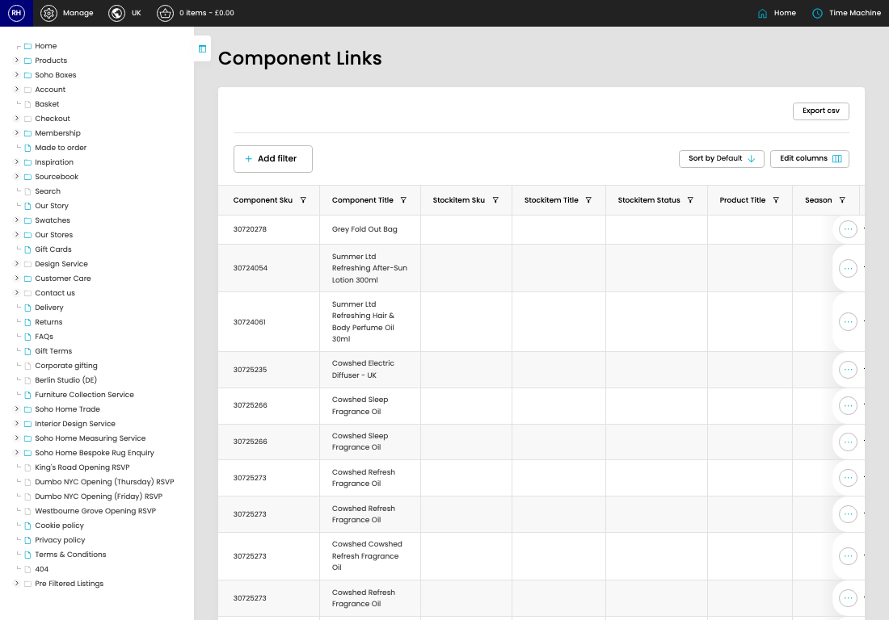

# Component Links

[Home](../../index.md) / Component Links

URL: [https://sohohome.com/cp/component-links-admin](https://sohohome.com/cp/component-links-admin)

Component Links lets admins find and review existing component links.

*Component Links page overview*

## How It Works

- After this has been updated.
- Refresh Action.

## Using This Page

1. Scan the fields in the table to find the component link you need.

## What You Can Do

### Review component links

Review the visible fields to check what already exists.

- Visible fields include Component Sku, Component Title, Stockitem Sku, Stockitem Title, Stockitem Status, Product Title, Season, and Outer Carton Weight.

Example rows:

| Component Sku | Component Title | Stockitem Sku | Stockitem Title | Stockitem Status | Product Title |
| --- | --- | --- | --- | --- | --- |
| 30720278 | Grey Fold Out Bag |  |  |  |  |
| 30724054 | Summer Ltd Refreshing After-Sun Lotion 300ml |  |  |  |  |
| 30724061 | Summer Ltd Refreshing Hair & Body Perfume Oil 30ml |  |  |  |  |
