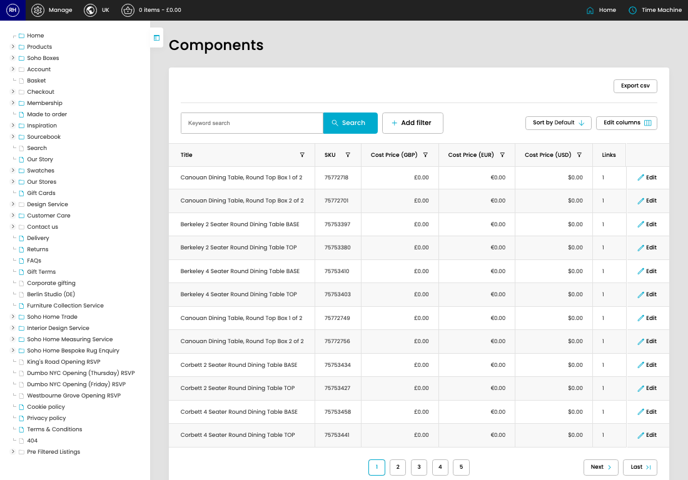

# Components

[Home](../../index.md) / Components

URL: [https://sohohome.com/cp/components-admin](https://sohohome.com/cp/components-admin)

A component SKU for a product. This is invisible to the customer

*Components page overview*

## Related Pages

- [Edit Component](../038-cp-components-admin-edit-id-829a8cde/README.md): Open an existing component when you need to check the setup or make a change.

## How It Works

- After this has been updated.
- Refresh Action.
- The key fields are Stock Item, Stock Item SKU, Stock Item Status, Title, and SKU, which explain what the record is for and how it can be used.

## Using This Page

1. Search or filter until you find the component you need.

## What You Can Do

### Review components

Search or filter the visible fields to find the component you need.

- Visible fields include Title, SKU, Cost Price (GBP), Cost Price (EUR), Cost Price (USD), and Links.

Example rows:

| Title | SKU | Cost Price (GBP) | Cost Price (EUR) | Cost Price (USD) | Links |
| --- | --- | --- | --- | --- | --- |
| Canouan Dining Table, Round Top Box 1 of 2 | 75772718 | £0.00 | €0.00 | $0.00 | 1 |
| Canouan Dining Table, Round Top Box 2 of 2 | 75772701 | £0.00 | €0.00 | $0.00 | 1 |
| Berkeley 2 Seater Round Dining Table BASE | 75753397 | £0.00 | €0.00 | $0.00 | 1 |
