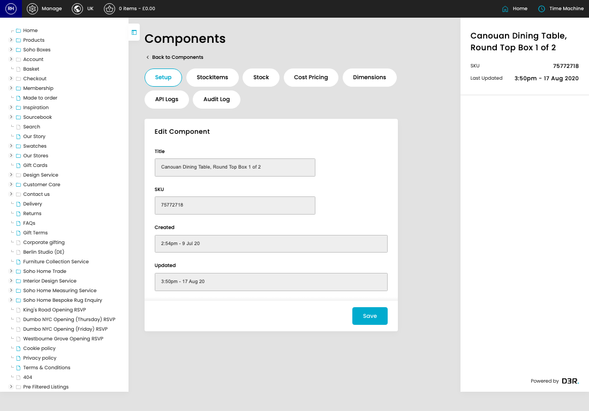

# Components

[Home](../../index.md) / [Components](../037-cp-components-admin-26a6081f/README.md) / Edit Component

URL: [https://sohohome.com/cp/components-admin/edit/:id](https://sohohome.com/cp/components-admin/edit/:id)

A component SKU for a product. This is invisible to the customer

*Components page overview*

## Related Pages

- [Components](../037-cp-components-admin-26a6081f/README.md): Search or filter the visible fields to find the component you need.

## How It Works

- After this has been updated.
- Refresh Action.
- The key fields are Stock Item, Stock Item SKU, Stock Item Status, Title, and SKU, which explain what the record is for and how it can be used.

## Using This Page

1. Open the existing component you need to change.
2. Work through the fields that are relevant to the change.
3. Save once the details are correct.

## What You Can Do

### Edit an existing component

Open an existing component when you need to check the setup or make a change.

- Save once the details are correct.

## Page Sections

- Setup
- StockItems
- Stock
- Cost Pricing
- Dimensions
- API Logs
- Audit Log
