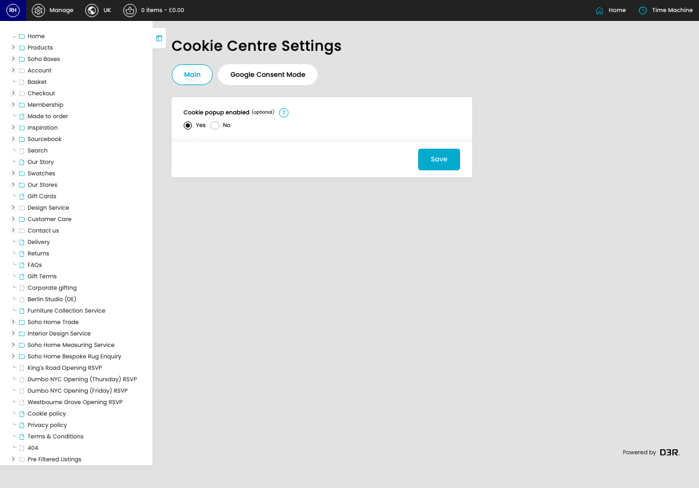
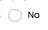

# Cookie settings

[Home](../../index.md) / Cookie settings

URL: [https://sohohome.com/cp/cookies-settings-admin](https://sohohome.com/cp/cookies-settings-admin)

Cookie settings contains the fields an admin uses to maintain this cookie setting.

*Cookie settings page overview*

## Using This Page

1. Open the Cookie settings screen.
2. Work through the fields that are relevant to the change, then save once the details are correct.

## What You Can Do

### Update settings

Use the fields on this screen to make the change, then save once the values are correct.

## Key Settings

### Cookie settings

#### Yes

*Yes setting*

Choose the option that matches this yes.

**Notes:** optional

#### No

*No setting*

Choose the option that matches this no.

**Notes:** optional

## Available Actions

- Main
- Google Consent Mode
