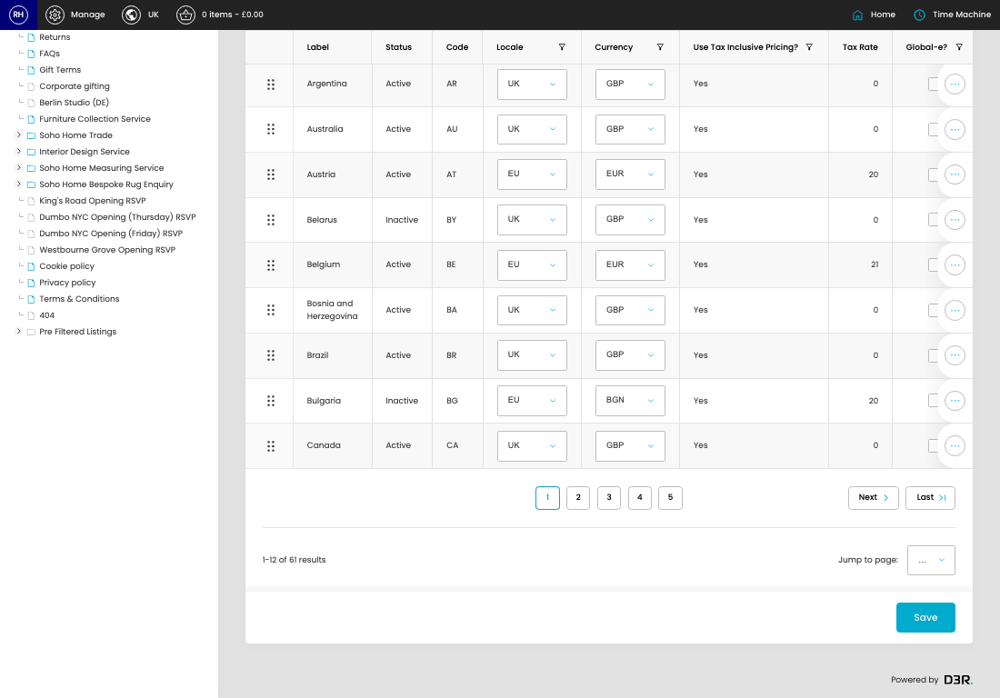
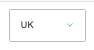
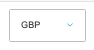

# Countries

[Home](../../index.md) / Countries

URL: [https://sohohome.com/cp/countries-admin](https://sohohome.com/cp/countries-admin)

Add the fields

*Countries page overview*

## Related Pages

- [Edit Country](../041-cp-countries-admin-edit-1-e82a6189/README.md): Open an existing country when you need to check the setup or make a change.

## How It Works

- The key fields are Global-e? and Synced Global-e Pricing?, which explain what the record is for and how it can be used.

## Using This Page

1. Open Countries from the CP navigation.
2. Search or filter until you find the country you need.

## What You Can Do

### Review countries

Search or filter the visible fields to find the country you need.

- Field: Label
- Field: Status
- Field: Code
- Field: Locale
- Field: Currency
- Field: Use Tax Inclusive Pricing?
- Field: Tax Rate
- Field: Global-e?

Example rows:

| Label | Status | Code | Locale | Currency | Use Tax Inclusive Pricing? |
| --- | --- | --- | --- | --- | --- |
|  | United Kingdom | Active | GB | select… UK EU US | select… GBP EUR USD BGN CZK DKK HUF PLN RON SEK |
|  | United States | Active | US | select… UK EU US | select… GBP EUR USD BGN CZK DKK HUF PLN RON SEK |
|  | American Samoa | Inactive | AS | select… UK EU US | select… GBP EUR USD BGN CZK DKK HUF PLN RON SEK |

### Update settings

Use the fields on this screen to make the change, then save once the values are correct.

## Key Settings

The sections below highlight the settings people are most likely to change.

### listing-locale_country-form

#### Country Locale

*Country Locale setting*

Set the Country Locale value for each relevant row in this section.

**Options:** UK, EU, US

#### Country Currency

*Country Currency setting*

Set the Country Currency value for each relevant row in this section.

**Options:** GBP, EUR, USD, BGN, CZK, DKK, HUF, PLN, RON, SEK

#### Country Global E

*Country Global E setting*

Set the Country Global E value for each relevant row in this section.
