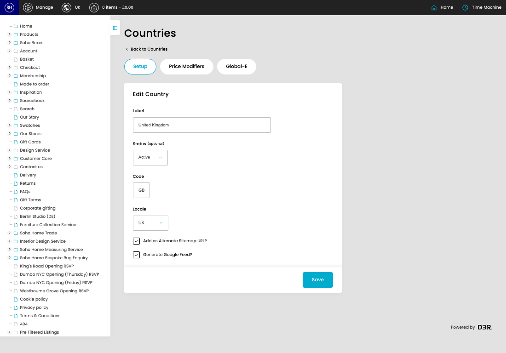
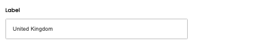
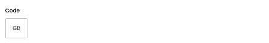
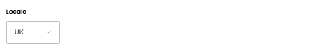

# Countries

[Home](../../index.md) / [Countries](../040-cp-countries-admin-b7d02bfb/README.md) / Edit Country

URL: [https://sohohome.com/cp/countries-admin/edit/:id](https://sohohome.com/cp/countries-admin/edit/:id)

Country model with global E options added

*Countries page overview*

## Related Pages

- [Countries](../040-cp-countries-admin-b7d02bfb/README.md): Search or filter the visible fields to find the country you need.

## How It Works

- The key fields are Global-e? and Synced Global-e Pricing?, which explain what the record is for and how it can be used.

## Using This Page

1. Open the existing country you need to change.
2. Work through the fields that are relevant to the change.
3. Save once the details are correct.

## What You Can Do

### Edit an existing country

Open an existing country when you need to check the setup or make a change.

- Save once the details are correct.

## Key Settings

### Edit Country

#### Label

*Label setting*

Add the label.

**Validation:** Required.

#### Status (optional)

*Status (optional) setting*

Choose the option that matches this status (optional).

**Options:** Active, Inactive

**Notes:** optional

#### Code

*Code setting*

Add the code.

**Validation:** Required.

#### Locale

*Locale setting*

Choose the option that matches this locale.

**Options:** UK, EU, US

#### Add as Alternate Sitemap URL?

Turn this on when add as alternate sitemap URL? should apply. Leave it off when it should not.

#### Generate Google Feed?

Turn this on when generate google feed? should apply. Leave it off when it should not.

## Page Sections

- Setup
- Price Modifiers
- Global-E
