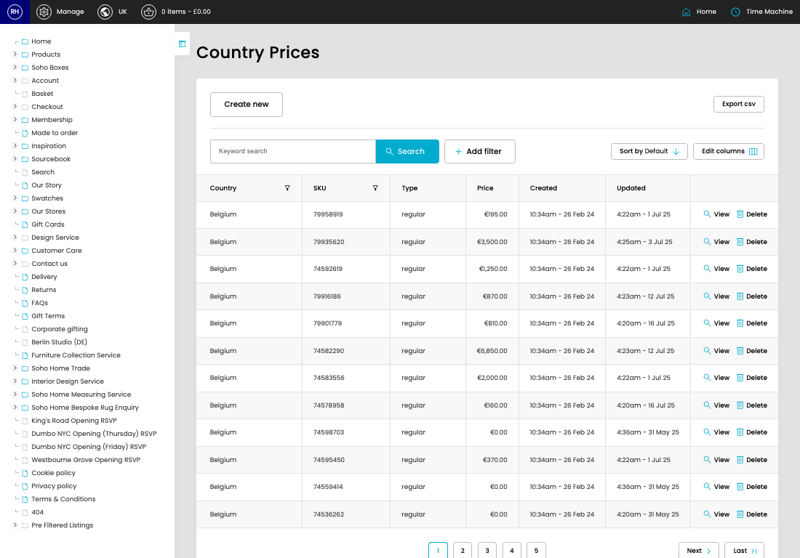

# Country Price Lists

[Home](../../index.md) / Country Price Lists

URL: [https://sohohome.com/cp/country-prices-admin](https://sohohome.com/cp/country-prices-admin)

Manage the country pricing

*Country Price Lists page overview*

## Related Pages

- [Create Country Price List](../043-cp-country-prices-admin-edit-new-5722350a/README.md): Use Create new when this country price list does not already exist. Complete the fields that describe it, then save.
- [View Country Price List](../044-cp-country-prices-admin-view-1-9fca00b5/README.md): Open an existing country price list when you need to check the full details.

## How It Works

- The key fields are Country, SKU, Type, and Price, which explain what the record is for and how it can be used.

## Using This Page

1. Open Country Price Lists from the CP navigation.
2. Search or filter until you find the country price list you need.

## What You Can Do

### Review country price lists

Search or filter the visible fields to find the country price list you need.

- Field: Country
- Field: SKU
- Field: Type
- Field: Price
- Field: Created
- Field: Updated

Example rows:

| Country | SKU | Type | Price | Created | Updated |
| --- | --- | --- | --- | --- | --- |
| Belgium | 79958919 | regular | €195.00 | 10:34am - 26 Feb 24 | 4:22am - 1 Jul 25 |
| Belgium | 79935620 | regular | €3,500.00 | 10:34am - 26 Feb 24 | 4:25am - 3 Jul 25 |
| Belgium | 74592619 | regular | €1,250.00 | 10:34am - 26 Feb 24 | 4:22am - 1 Jul 25 |
