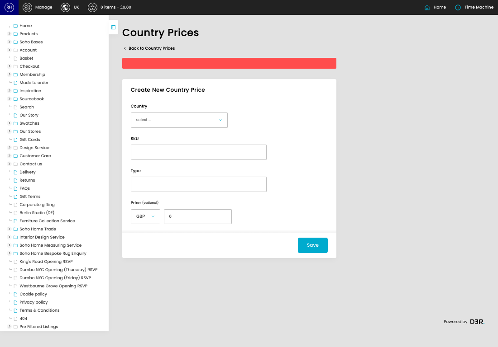
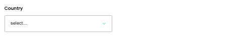
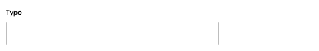
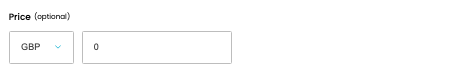
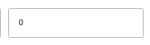

# Country Price Lists

[Home](../../index.md) / [Country Price Lists](../042-cp-country-prices-admin-aadcbf66/README.md) / Create Country Price List

URL: [https://sohohome.com/cp/country-prices-admin/edit/new](https://sohohome.com/cp/country-prices-admin/edit/new)

Manage the country pricing

*Country Price Lists page overview*

## Related Pages

- [Country Price Lists](../042-cp-country-prices-admin-aadcbf66/README.md): Search or filter the visible fields to find the country price list you need.
- [View Country Price List](../044-cp-country-prices-admin-view-id-9fca00b5/README.md): Open an existing country price list when you need to check the full details.

## How It Works

- The key fields are Country, SKU, Type, and Price, which explain what the record is for and how it can be used.

## Using This Page

1. Create the new country price list from this screen.
2. Work through the fields that are relevant to the new record.
3. Save once the details are correct.

## What You Can Do

### Create a new country price list

Use Create new when this country price list does not already exist. Complete the fields that describe it, then save.

### Update settings

Use the fields on this screen to make the change, then save once the values are correct.

## Key Settings

### Create New Country Price

#### Country

*Country setting*

Choose the option that matches this country.

**Options:** United Kingdom, ---, Afghanistan, Albania, Algeria, American Samoa, Andorra, Angola, Anguilla, Antarctica, Antigua and Barbuda, Argentina, and 17 more

#### SKU

*SKU setting*

Add the SKU.

**Validation:** Required.

#### Type

*Type setting*

Add the type.

**Validation:** Required.

#### country_price_price_currency

*country_price_price_currency setting*

Choose the option that matches this country_price_price_currency.

**Options:** EUR, USD, JPY, CZK, DKK, GBP, HUF, PLN, RON, SEK, CHF, ISK, and 18 more

**Notes:** optional

#### Price (optional)

*Price (optional) setting*

Add the price (optional).

**Notes:** optional
