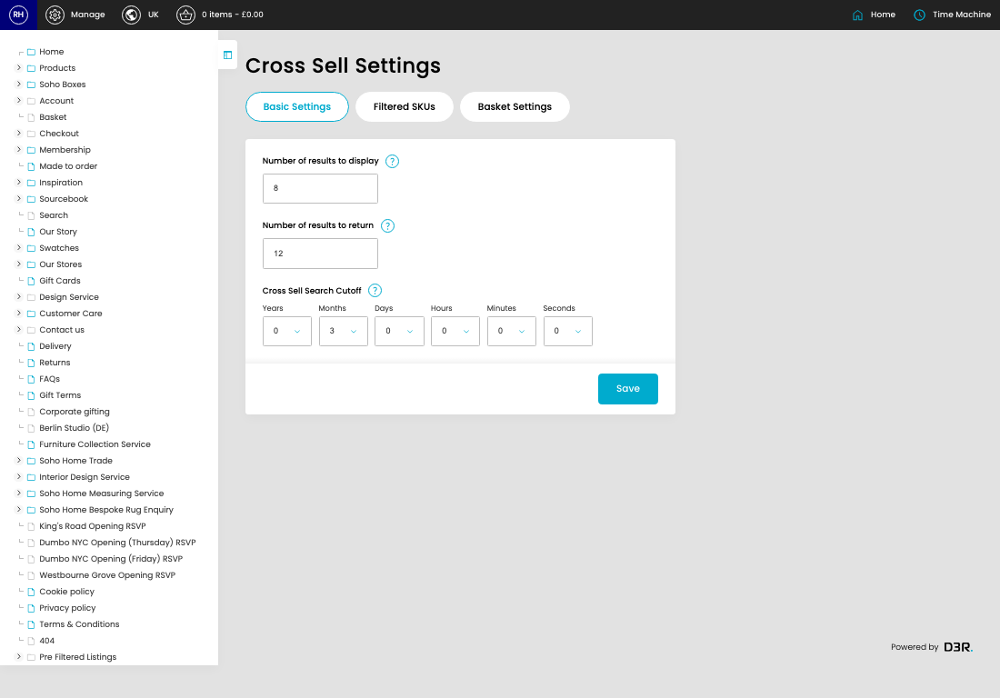
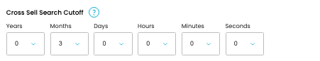
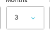
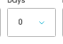
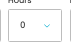
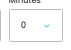
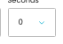

# Cross Sell

[Home](../../index.md) / Cross Sell

URL: [https://sohohome.com/cp/cross-sell-admin](https://sohohome.com/cp/cross-sell-admin)

Cross Sell covers the admin screen used to review and maintain cross sell.

*Cross Sell page overview*

## How It Works

- The key fields are Number of results to display and Recommender, which explain what the record is for and how it can be used.

## Using This Page

1. Open the Cross Sell screen.
2. Work through the fields that are relevant to the change, then save once the details are correct.

## What You Can Do

### Update settings

Use the fields on this screen to make the change, then save once the values are correct.

## Key Settings

### Cross Sell Settings

#### Number of results to display

*Number of results to display setting*

Add the number of results to display.

**Validation:** Required.

**Notes:** How many items we should display in the carousel

#### Number of results to return

*Number of results to return setting*

Add the number of results to return.

**Validation:** Required.

#### Years

*Years setting*

Choose the option that matches this years.

**Options:** …, 0, 1, 2, 3, 4, 5, 6, 7, 8, 9, 10

#### Months

*Months setting*

Choose the option that matches this months.

**Options:** …, 0, 1, 2, 3, 4, 5, 6, 7, 8, 9, 10, and 1 more

#### Days

*Days setting*

Choose the option that matches this days.

**Options:** …, 0, 1, 2, 3, 4, 5, 6, 7, 8, 9, 10, and 18 more

#### Hours

*Hours setting*

Choose the option that matches this hours.

**Options:** …, 0, 1, 2, 3, 4, 5, 6, 7, 8, 9, 10, and 13 more

#### Minutes

*Minutes setting*

Choose the option that matches this minutes.

**Options:** …, 0, 1, 2, 3, 4, 5, 6, 7, 8, 9, 10, and 18 more

#### Seconds

*Seconds setting*

Choose the option that matches this seconds.

**Options:** …, 0, 1, 2, 3, 4, 5, 6, 7, 8, 9, 10, and 18 more

## Available Actions

- Basic Settings
- Filtered SKUs
- Basket Settings
