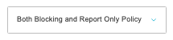
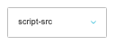
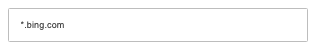
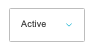

# Content Security Policy

[Home](../../index.md) / Content Security Policy

URL: [https://sohohome.com/cp/csp-admin](https://sohohome.com/cp/csp-admin)

Content Security Policy covers the admin screen used to review and maintain content security policy.

*Content Security Policy page overview*

## Related Pages

- [Edit Content Security Policy](../047-cp-csp-admin-edit-1-8773e0c7/README.md): Open an existing content security policy when you need to check the setup or make a change.

## How It Works

- The key fields are Scope, Directive, Source URL Value, HTTPS Sources Only, and Self Allowed, which explain what the record is for and how it can be used.

## Using This Page

1. Open Content Security Policy from the CP navigation.
2. Search or filter until you find the content security policy you need.

## What You Can Do

### Review content security policy

Search or filter the visible fields to find the content security policy you need.

- Field: Scope
- Field: Directive
- Field: Source URL Value
- Field: HTTPS Sources Only
- Field: Self Allowed
- Field: Data Allowed
- Field: Blob Allowed
- Field: Media Stream Allowed
- Field: Unsafe Eval Allowed
- Field: Unsafe Inline Allowed
- Field: Status
- Field: Note

Example rows:

| Scope | Directive | Source URL Value | HTTPS Sources Only | Self Allowed | Data Allowed |
| --- | --- | --- | --- | --- | --- |
| None Blocking Policy Report Only Policy Both Blocking and Report Only Policy | select… child-src connect-src default-src font-src frame-ancestors frame-src img-src manif |  | No | No | No |
| None Blocking Policy Report Only Policy Both Blocking and Report Only Policy | select… child-src connect-src default-src font-src frame-ancestors frame-src img-src manif |  | No | No | No |
| None Blocking Policy Report Only Policy Both Blocking and Report Only Policy | select… child-src connect-src default-src font-src frame-ancestors frame-src img-src manif |  | No | No | No |

### Update settings

Use the fields on this screen to make the change, then save once the values are correct.

## Key Settings

The sections below highlight the settings people are most likely to change.

### listing-d3r\websecurity\model\source-form

#### Source Scope

*Source Scope setting*

Set the Source Scope value for each relevant row in this section.

**Options:** None, Blocking Policy, Report Only Policy, Both Blocking and Report Only Policy

#### Source Directive

*Source Directive setting*

Set the Source Directive value for each relevant row in this section.

**Options:** child-src, connect-src, default-src, font-src, frame-ancestors, frame-src, img-src, manifest-src, media-src, object-src, prefetch-src, script-src, and 6 more

#### Source Value

*Source Value setting*

Set the Source Value value for each relevant row in this section.

#### Source Status

*Source Status setting*

Set the Source Status value for each relevant row in this section.

**Options:** Active, Inactive
