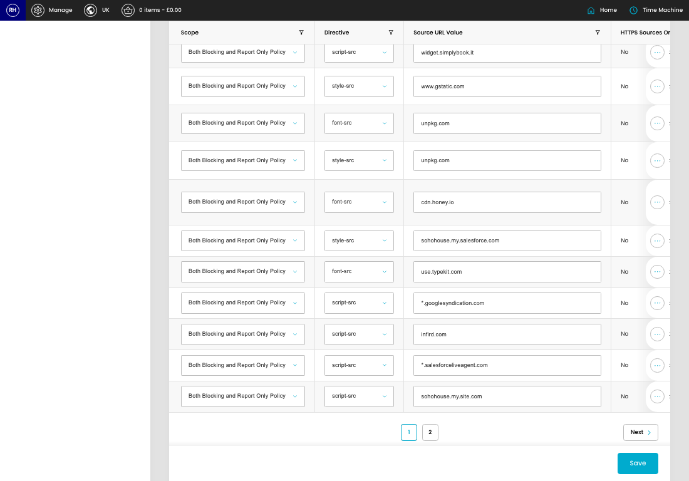

# Content Security Policy

[Home](../../index.md) / Content Security Policy

URL: [https://sohohome.com/cp/csp-admin](https://sohohome.com/cp/csp-admin)

Content Security Policy lets admins find and review existing content security policy.

*Content Security Policy page overview*

## Related Pages

- [Edit Content Security Policy](../047-cp-csp-admin-edit-id-8773e0c7/README.md): Open an existing content security policy when you need to check the setup or make a change.

## How It Works

- The key fields are Scope, Directive, Source URL Value, HTTPS Sources Only, and Self Allowed, which explain what the record is for and how it can be used.

## Using This Page

1. Search or filter until you find the content security policy you need.

## What You Can Do

### Review content security policy

Search or filter the visible fields to find the content security policy you need.

- Visible fields include Scope, Directive, Source URL Value, HTTPS Sources Only, Self Allowed, Data Allowed, Blob Allowed, and Media Stream Allowed.

Example rows:

| Scope | Directive | Source URL Value | HTTPS Sources Only | Self Allowed | Data Allowed |
| --- | --- | --- | --- | --- | --- |
| None Blocking Policy Report Only Policy Both Blocking and Report Only Policy | select… child-src connect-src default-src font-src frame-ancestors frame-src img-src manif |  | No | No | No |
| None Blocking Policy Report Only Policy Both Blocking and Report Only Policy | select… child-src connect-src default-src font-src frame-ancestors frame-src img-src manif |  | No | No | No |
| None Blocking Policy Report Only Policy Both Blocking and Report Only Policy | select… child-src connect-src default-src font-src frame-ancestors frame-src img-src manif |  | No | No | No |

### Update settings

Use the fields on this screen to make the change, then save once the values are correct.
