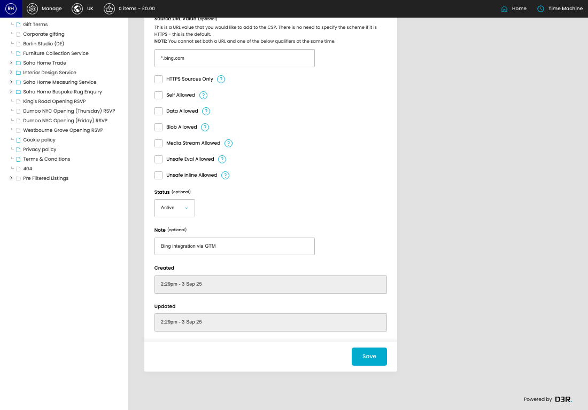
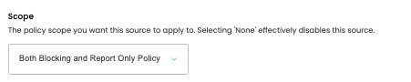
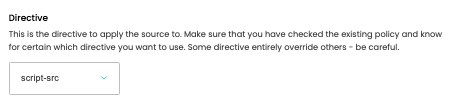
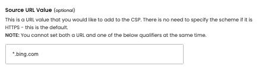

# Content Security Policy

[Home](../../index.md) / [Content Security Policy](../046-cp-csp-admin-afdcfabe/README.md) / Edit Content Security Policy

URL: [https://sohohome.com/cp/csp-admin/edit/:id](https://sohohome.com/cp/csp-admin/edit/:id)

Use this screen when you need to check or change an existing content security policy.

*Content Security Policy page overview*

## Related Pages

- [Content Security Policy](../046-cp-csp-admin-afdcfabe/README.md): Search or filter the visible fields to find the content security policy you need.

## How It Works

- The key fields are Scope, Directive, Source URL Value, HTTPS Sources Only, and Self Allowed, which explain what the record is for and how it can be used.

## Using This Page

1. Open the existing content security policy you need to change.
2. Work through the fields that are relevant to the change.
3. Save once the details are correct.

## What You Can Do

### Edit an existing content security policy

Open an existing content security policy when you need to check the setup or make a change.

- Save once the details are correct.

## Key Settings

### Edit Source

#### Scope

*Scope setting*

Choose the option that matches this scope.

**Effect:** The policy scope you want this source to apply to. Selecting 'None' effectively disables this source.

**Options:** None, Blocking Policy, Report Only Policy, Both Blocking and Report Only Policy

**Notes:** The policy scope you want this source to apply to. Selecting 'None' effectively disables this source.

#### Directive

*Directive setting*

Choose the option that matches this directive.

**Effect:** This is the directive to apply the source to. Make sure that you have checked the existing policy and know for certain which directive you want to use. Some directive entirely override others - be careful.

**Options:** child-src, connect-src, default-src, font-src, frame-ancestors, frame-src, img-src, manifest-src, media-src, object-src, prefetch-src, script-src, and 6 more

**Notes:** This is the directive to apply the source to. Make sure that you have checked the existing policy and know for certain which directive you want to use. Some directive entirely override others - be careful.

#### Source URL Value (optional)

*Source URL Value (optional) setting*

Add the source URL value (optional).

**Effect:** This is a URL value that you would like to add to the CSP. There is no need to specify the scheme if it is HTTPS - this is the default. NOTE: You cannot set both a URL and one of the below qualifiers at the same time. optional

**Notes:** This is a URL value that you would like to add to the CSP. There is no need to specify the scheme if it is HTTPS - this is the default. NOTE: You cannot set both a URL and one of the below qualifiers at the same time. optional

#### HTTPS Sources Only

Turn this on when HTTPS sources only should apply. Leave it off when it should not.

**Notes:** This directive mandates that only HTTPS sources are allowed. Other sources can be explicitly allowed in the policy but the default will be HTTPS only.

#### Self Allowed

Turn this on when self allowed should apply. Leave it off when it should not.

**Notes:** Allow resources to be loaded from the same origin as the current page (same scheme, host, and port)

#### Data Allowed

Turn this on when data allowed should apply. Leave it off when it should not.

**Notes:** Allow resources to be loaded from data: URIs

#### Blob Allowed

Turn this on when blob allowed should apply. Leave it off when it should not.

**Notes:** Allow resources to be loaded from blob: URIs

#### Media Stream Allowed

Turn this on when media stream allowed should apply. Leave it off when it should not.

**Notes:** Allow resources from MediaStream object URLs

#### Unsafe Eval Allowed

Turn this on when unsafe eval allowed should apply. Leave it off when it should not.

**Notes:** Allow JavaScript features that generate code from strings, like eval(), new Function(), setTimeout(string), etc

#### Unsafe Inline Allowed

Turn this on when unsafe inline allowed should apply. Leave it off when it should not.

#### Status (optional)

Choose the option that matches this status (optional).

**Options:** Active, Inactive

**Notes:** optional

#### Note (optional)

Add the note (optional).

**Notes:** optional
