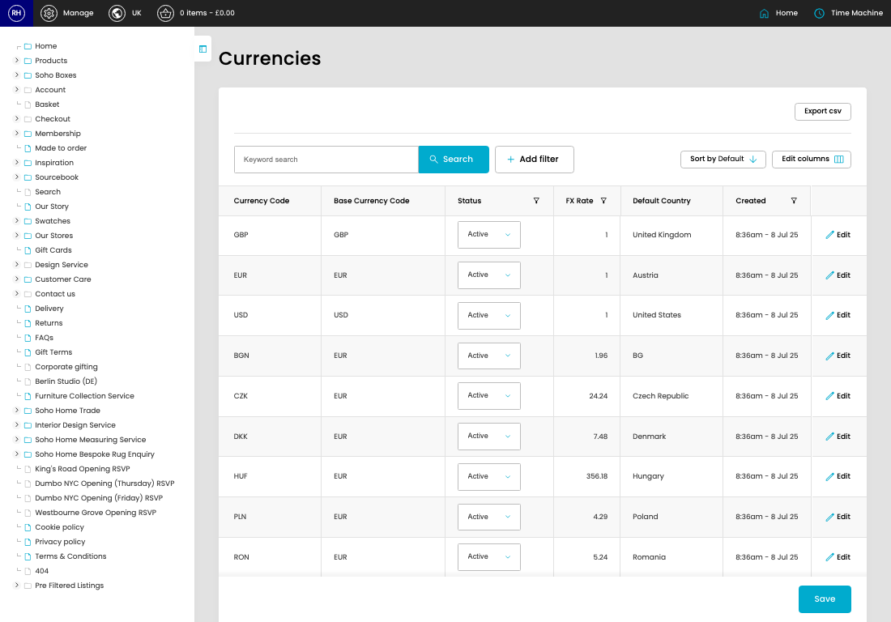
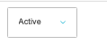

# Currencies

[Home](../../index.md) / Currencies

URL: [https://sohohome.com/cp/currencies-admin](https://sohohome.com/cp/currencies-admin)

Currencies covers the admin screen used to review and maintain currencies.

*Currencies page overview*

## Related Pages

- [Edit Currency](../049-cp-currencies-admin-edit-1-6b3b306f/README.md): Open an existing currency when you need to check the setup or make a change.

## How It Works

- Makes sure the transfer property is set appropriately.
- The key fields are Currency Code, Base Currency Code, Status, FX Rate, and Default Country, which explain what the record is for and how it can be used.

## Using This Page

1. Open Currencies from the CP navigation.
2. Search or filter until you find the currency you need.

## What You Can Do

### Review currencies

Search or filter the visible fields to find the currency you need.

- Field: Currency Code
- Field: Base Currency Code
- Field: Status
- Field: FX Rate
- Field: Default Country
- Field: Created
- Field: Updated

Example rows:

| Currency Code | Base Currency Code | Status | FX Rate | Default Country | Created |
| --- | --- | --- | --- | --- | --- |
| GBP | GBP | select… Active Inactive | 1 | United Kingdom | 8:36am - 8 Jul 25 |
| EUR | EUR | select… Active Inactive | 1 | Austria | 8:36am - 8 Jul 25 |
| USD | USD | select… Active Inactive | 1 | United States | 8:36am - 8 Jul 25 |

### Update settings

Use the fields on this screen to make the change, then save once the values are correct.

## Key Settings

The sections below highlight the settings people are most likely to change.

### listing-store_currency-form

#### Currency Status

*Currency Status setting*

Set the Currency Status value for each relevant row in this section.

**Options:** Active, Inactive
