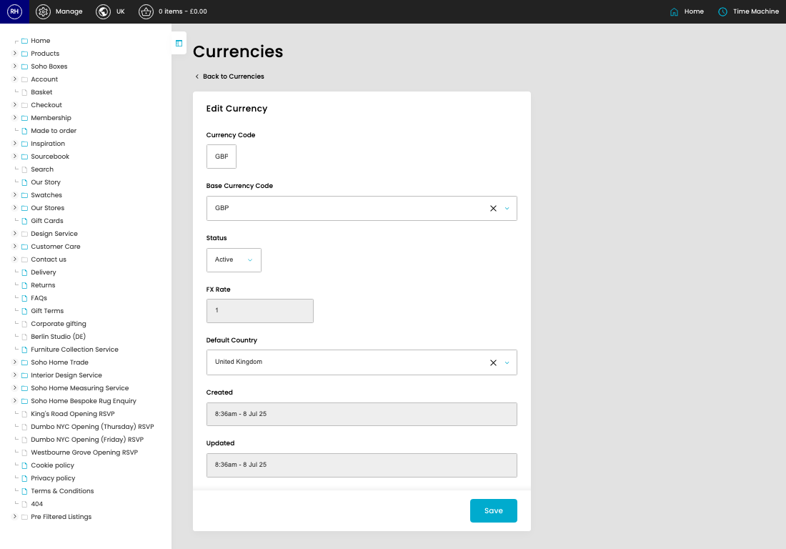
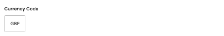
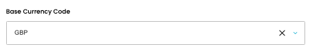
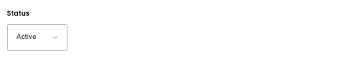
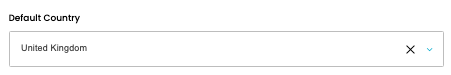

# Currencies

[Home](../../index.md) / Edit Currency

URL: [https://sohohome.com/cp/currencies-admin/edit/1](https://sohohome.com/cp/currencies-admin/edit/1)

Currencies covers the admin screen used to review and maintain currencies.

*Currencies page overview*

## Related Pages

- [Currencies](../048-cp-currencies-admin-f7b395f4/README.md): Search or filter the visible fields to find the currency you need.

## How It Works

- Makes sure the transfer property is set appropriately.
- The key fields are Currency Code, Base Currency Code, Status, FX Rate, and Default Country, which explain what the record is for and how it can be used.

## Using This Page

1. Open the existing currency you need to change.
2. Work through the fields that are relevant to the change.
3. Save once the details are correct.

## What You Can Do

### Edit an existing currency

Open an existing currency when you need to check the setup or make a change.

- Save once the details are correct.

## Key Settings

### Edit Currency

#### Currency Code

*Currency Code setting*

Add the currency code.

**Validation:** Required.

#### currency_base_currency_code_autocomplete

*currency_base_currency_code_autocomplete setting*

Add the currency_base_currency_code_autocomplete.

#### Status

*Status setting*

Choose the option that matches this status.

**Options:** Active, Inactive

#### currency_default_country_autocomplete

*currency_default_country_autocomplete setting*

Add the currency_default_country_autocomplete.
