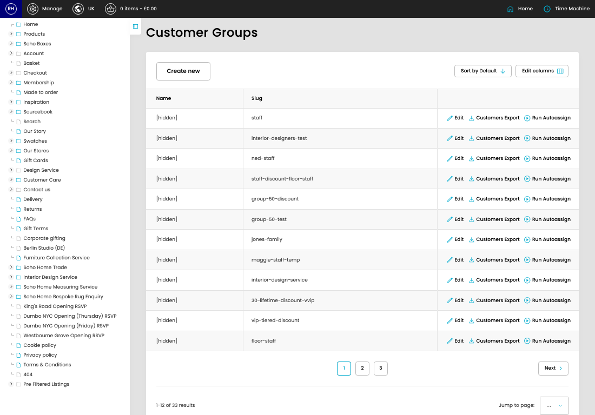

# Customer Groups

[Home](../../index.md) / Customer Groups

URL: [https://sohohome.com/cp/customer-groups-admin](https://sohohome.com/cp/customer-groups-admin)

Customer Groups covers the admin screen used to review and maintain customer groups.

*Customer Groups page overview*

## Related Pages

- [Edit Customer Group](../051-cp-customer-groups-admin-edit-2-840aae89/README.md): Open an existing customer group when you need to check the setup or make a change.

## How It Works

- Makes sure the transfer property is set appropriately.
- The key fields are Name, Slug, Auto-assign customers with email address containing, New Order Notification Emails, and Customers, which explain what the record is for and how it can be used.

## Using This Page

1. Open Customer Groups from the CP navigation.
2. Scan the fields in the table to find the customer group you need.

## What You Can Do

### Review customer groups

Review the visible fields to check what already exists.

- Field: Name
- Field: Slug

Example rows:

| Name | Slug |
| --- | --- |
| Soho House Staff Discount | staff |
| Interior Designers Test | interior-designers-test |
| Ned Staff | ned-staff |
