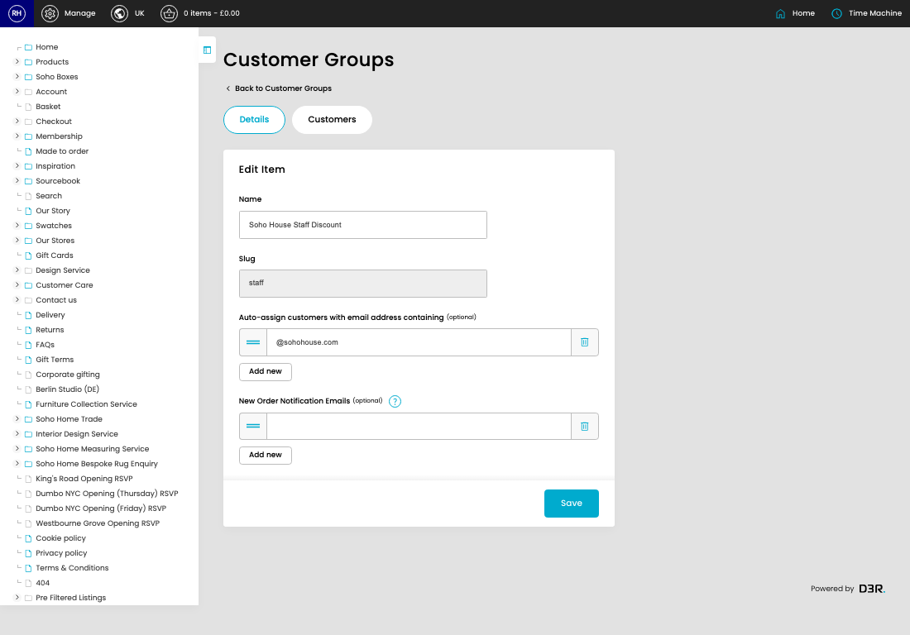
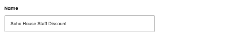
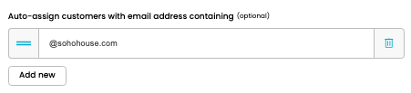
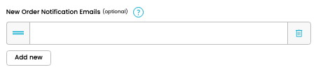

# Customer Groups

[Home](../../index.md) / [Customer Groups](../050-cp-customer-groups-admin-79adba40/README.md) / Edit Customer Group

URL: [https://sohohome.com/cp/customer-groups-admin/edit/:id](https://sohohome.com/cp/customer-groups-admin/edit/:id)

Customer Groups is used to find customer accounts and review the account, address, membership, basket, and order details available to admins.

*Customer Groups page overview*

## Related Pages

- [Customer Groups](../050-cp-customer-groups-admin-79adba40/README.md): Review the visible fields to check what already exists.

## How It Works

- Makes sure the transfer property is set appropriately.
- The key fields are Name, Slug, Auto-assign customers with email address containing, New Order Notification Emails, and Customers, which explain what the record is for and how it can be used.

## Using This Page

1. Open the existing customer group you need to change.
2. Work through the fields that are relevant to the change.
3. Save once the details are correct.

## What You Can Do

### Edit an existing customer group

Open an existing customer group when you need to check the setup or make a change.

- Save once the details are correct.

## Key Settings

### Edit Item

#### Name

*Name setting*

Add the name.

**Validation:** Required.

#### group_email_patterns[]

*group_email_patterns[] setting*

Add the group_email_patterns[].

#### group_new_order_notification_emails[]

*group_new_order_notification_emails[] setting*

Add the group_new_order_notification_emails[].

**Notes:** Email addresses to receive notifications of new orders placed by customers in this group

## Page Sections

- Details
- Customers
