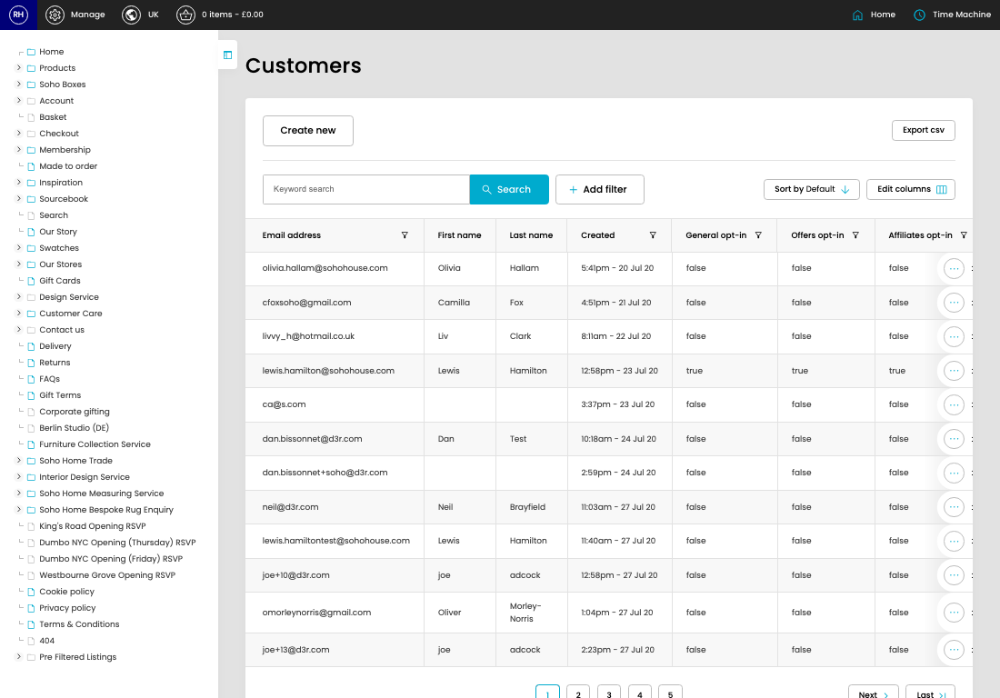

# Customers

[Home](../../index.md) / Customers

URL: [https://sohohome.com/cp/customers](https://sohohome.com/cp/customers)

Customers is used to find customer accounts and review the account, address, membership, basket, and order details available to admins.

*Customers page overview*

## Related Pages

- [Edit Customer](../053-cp-customers-edit-id-601e81ba/README.md): Open an existing customer when you need to check the setup or make a change.

## How It Works

- Sync a customer's details down from digital house.
- Makes sure the transfer property is set appropriately.
- The key fields are Wishlists, which explain what the record is for and how it can be used.

## Using This Page

1. Search or filter until you find the customer you need.

## What You Can Do

### Review customers

Search or filter the visible fields to find the customer you need.

- Visible fields include Email address, First name, Last name, Created, General opt-in, Offers opt-in, Affiliates opt-in, and Membership Type.
