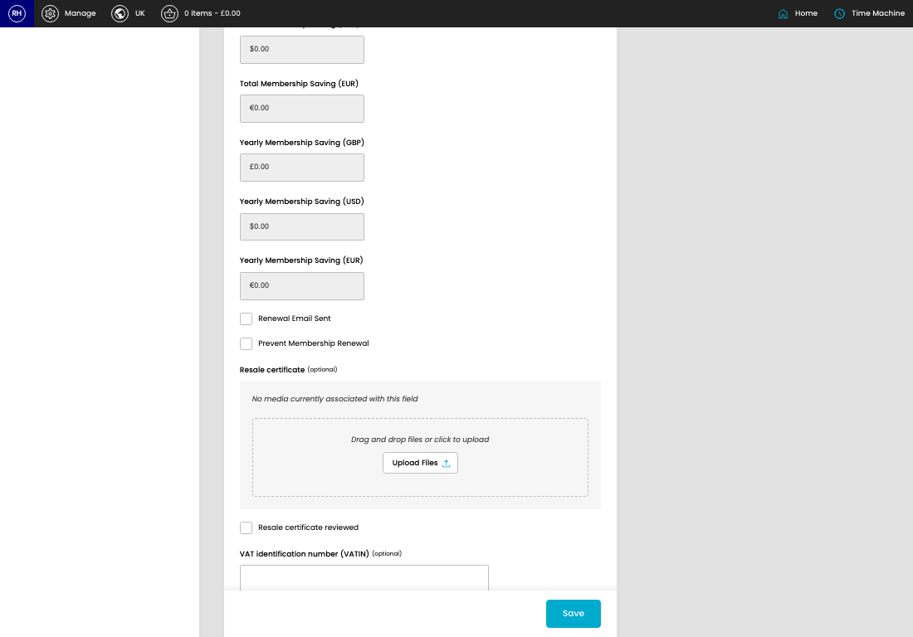
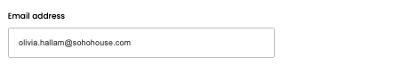
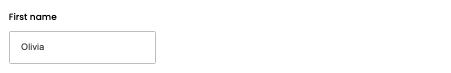
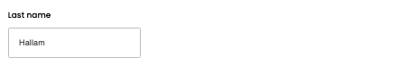
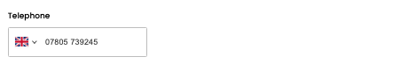
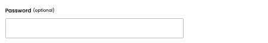
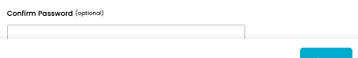
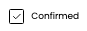
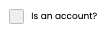

# Customers

[Home](../../index.md) / Edit Customer

URL: [https://sohohome.com/cp/customers/edit/1](https://sohohome.com/cp/customers/edit/1)

Customers covers the admin screen used to review and maintain customers.

*Customers page overview*

## Related Pages

- [Customers](../052-cp-customers-cbb2a4e5/README.md): Search or filter the visible fields to find the customer you need.

## How It Works

- Sync a customer's details down from digital house.
- Makes sure the transfer property is set appropriately.
- The key fields are Wishlists, which explain what the record is for and how it can be used.

## Using This Page

1. Open the existing customer you need to change.
2. Work through the fields that are relevant to the change.
3. Save once the details are correct.

## What You Can Do

### Edit an existing customer

Open an existing customer when you need to check the setup or make a change.

- Save once the details are correct.

## Key Settings

### Edit Customer

#### Email address

*Email address setting*

Add the email address.

**Validation:** Required.

#### First name

*First name setting*

Add the first name.

**Validation:** Required.

#### Last name

*Last name setting*

Add the last name.

**Validation:** Required.

#### 07400 123456

*07400 123456 setting*

Use the expected format shown by the placeholder: "07400 123456".

#### Password (optional)

*Password (optional) setting*

Add the password (optional).

**Notes:** optional

#### Confirm Password (optional)

*Confirm Password (optional) setting*

Add the confirm password (optional).

**Notes:** optional

#### Confirmed

*Confirmed setting*

Turn this on when confirmed should apply. Leave it off when it should not.

#### Is an account?

*Is an account? setting*

Turn this on when the answer should be yes. Leave it off when it should not apply.

#### Optin

Turn this on when optin should apply. Leave it off when it should not.

#### General opt-in

Turn this on when general opt-in should apply. Leave it off when it should not.

#### Offers opt-in

Turn this on when offers opt-in should apply. Leave it off when it should not.

#### Affiliates opt-in

Turn this on when affiliates opt-in should apply. Leave it off when it should not.

#### Date of birth (optional)

Add the date of birth (optional).

**Notes:** optional

#### Gender (optional)

Choose the option that matches this gender (optional).

**Options:** Male, Female, N/A

**Notes:** optional

#### Renewal Email Sent

Turn this on when renewal email sent should apply. Leave it off when it should not.

#### Prevent Membership Renewal

Turn this on when prevent membership renewal should apply. Leave it off when it should not.

#### Resale certificate reviewed

Turn this on when resale certificate reviewed should apply. Leave it off when it should not.

#### VAT identification number (VATIN) (optional)

Add the VAT identification number (VATIN) (optional).

**Notes:** optional

## Available Actions

- Details
- Addresses
- Payment Cards
- Salesforce Data
- D3R Crystallised Membership Data
- Subscriptions
- Applications
- Basket
- Orders
- Groups
- Notes
- Email Logs
- Impressions
- Spend
- Wishlists
- Audit Log
- Change country for phone number, currently selected United Kingdom (+44)
- Upload Files
