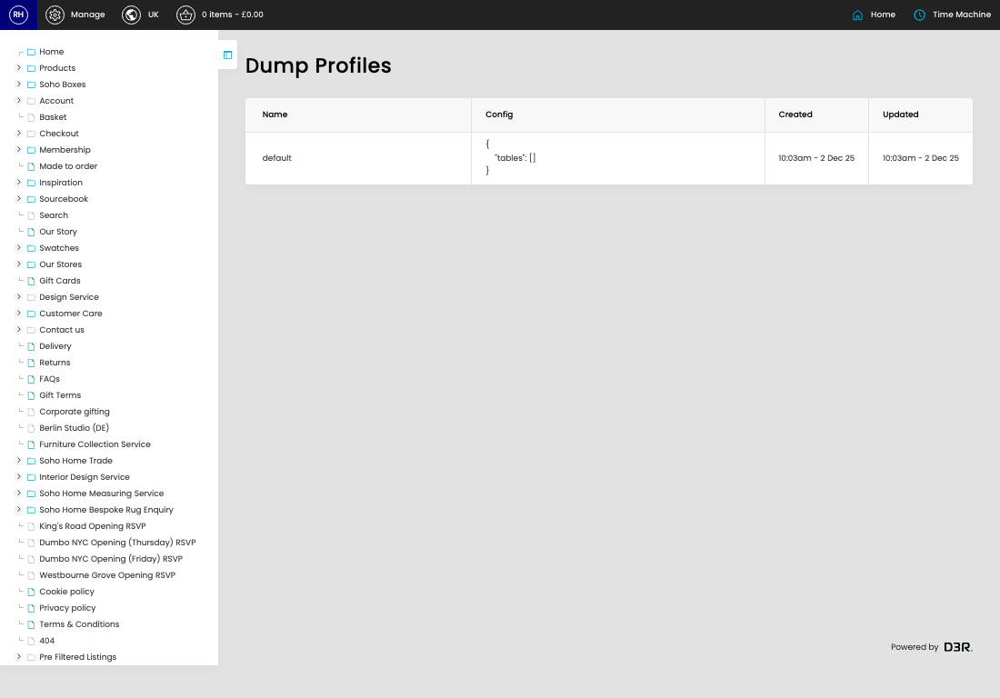

# Database Dump Profiles

[Home](../../index.md) / Database Dump Profiles

URL: [https://sohohome.com/cp/database-dumper-admin](https://sohohome.com/cp/database-dumper-admin)

Database Dump Profiles lets admins find and review existing database dump profiles.

*Database Dump Profiles page overview*

## Using This Page

1. Scan the fields in the table to find the database dump profile you need.

## What You Can Do

### Review database dump profiles

Review the visible fields to check what already exists.

- Visible fields include Name, Config, Created, and Updated.

Example rows:

| Name | Config | Created | Updated |
| --- | --- | --- | --- |
| default | { "tables": [] } | 10:03am - 2 Dec 25 | 10:03am - 2 Dec 25 |
