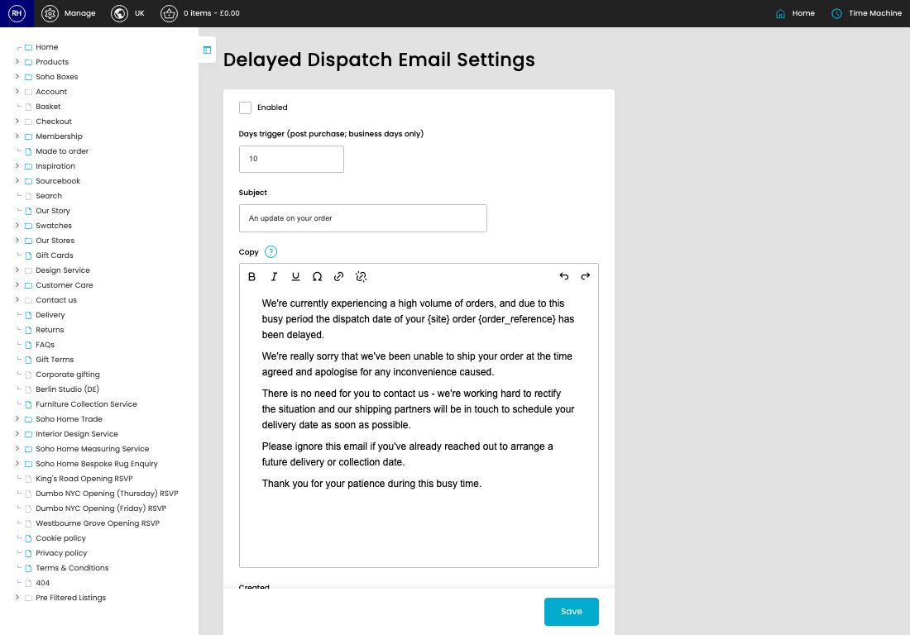
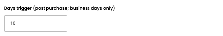
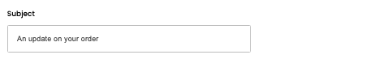

# Delayed Dispatch Email Settings

[Home](../../index.md) / Delayed Dispatch Email Settings

URL: [https://sohohome.com/cp/delayed-dispatch-email-settings-admin](https://sohohome.com/cp/delayed-dispatch-email-settings-admin)

Delayed Dispatch Email Settings contains the fields an admin uses to maintain this delayed dispatch email setting.

*Delayed Dispatch Email Settings page overview*

## How It Works

- Makes sure the transfer property is set appropriately.
- The key fields are Enabled, Days trigger (post purchase; business days only), Subject, and Copy, which explain what the record is for and how it can be used.

## Using This Page

1. Open the Delayed Dispatch Email Settings screen.
2. Work through the fields that are relevant to the change, then save once the details are correct.

## What You Can Do

### Update settings

Use the fields on this screen to make the change, then save once the values are correct.

## Key Settings

### Delayed Dispatch Email Settings

#### Enabled

Turn this on when enabled should apply. Leave it off when it should not.

#### Days trigger (post purchase; business days only)

*Days trigger (post purchase; business days only) setting*

Add the days trigger (post purchase; business days only).

**Validation:** Required.

#### Subject

*Subject setting*

Add the subject.

**Validation:** Required.

#### Copy

Write the copy content.

**Notes:** `{site}` and `{order_reference}` is available for dynamic copy replacement
