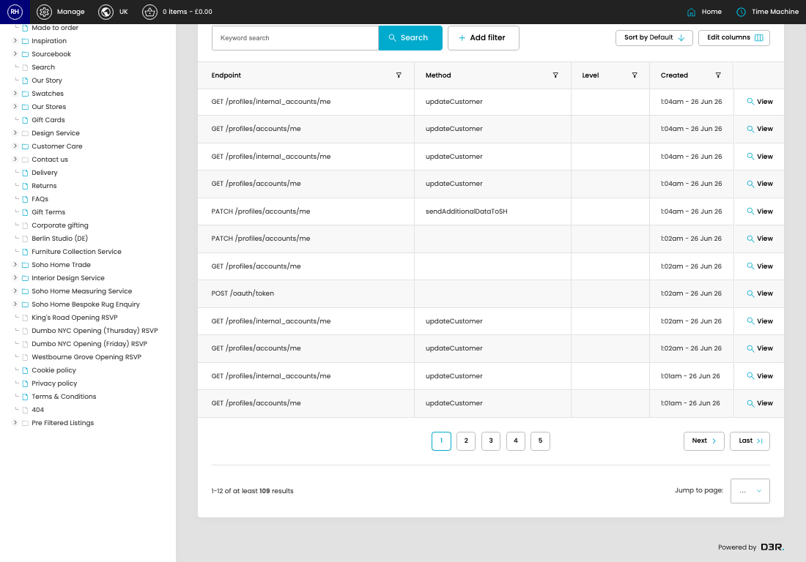

# Digital House Api Logs

[Home](../../index.md) / Digital House Api Logs

URL: [https://sohohome.com/cp/dh-api-logs](https://sohohome.com/cp/dh-api-logs)

DH API Log listing

*Digital House Api Logs page overview*

## Related Pages

- [View Digital House Api Log](../058-cp-dh-api-logs-view-6116376-e481b763/README.md): Open an existing digital house api log when you need to check the full details.

## How It Works

- Update the crystallised membership fields from DigitalHouse or our applications model.
- Sync a customer's details down from digital house.
- The key fields are Log, Context, Endpoint, Model, and Method, which explain what the record is for and how it can be used.

## Using This Page

1. Open Digital House Api Logs from the CP navigation.
2. Search or filter until you find the digital house api log you need.

## What You Can Do

### Review digital house api logs

Search or filter the visible fields to find the digital house api log you need.

- Field: Endpoint
- Field: Method
- Field: Level
- Field: Created

Example rows:

| Endpoint | Method | Level | Created |
| --- | --- | --- | --- |
| GET /profiles/internal_accounts/me | updateCustomer |  | 1:04am - 26 Jun 26 |
| GET /profiles/accounts/me | updateCustomer |  | 1:04am - 26 Jun 26 |
| GET /profiles/internal_accounts/me | updateCustomer |  | 1:04am - 26 Jun 26 |
