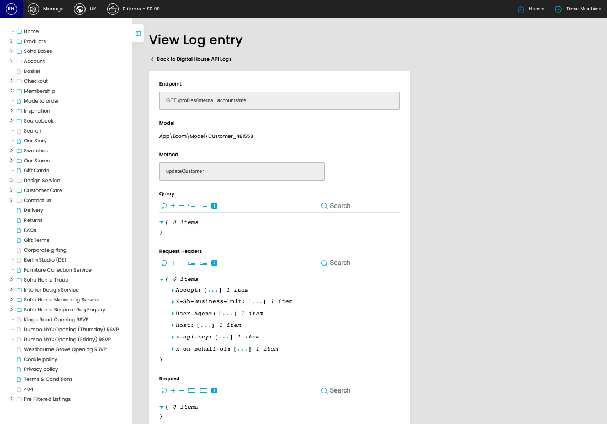

# Digital House Api Logs

[Home](../../index.md) / View Digital House Api Log

URL: [https://sohohome.com/cp/dh-api-logs/view/6116376](https://sohohome.com/cp/dh-api-logs/view/6116376)

DH API Log listing

*Digital House Api Logs page overview*

## Related Pages

- [Digital House Api Logs](../057-cp-dh-api-logs-242d06fb/README.md): Search or filter the visible fields to find the digital house api log you need.

## How It Works

- Update the crystallised membership fields from DigitalHouse or our applications model.
- Sync a customer's details down from digital house.
- The key fields are Log, Context, Endpoint, Model, and Method, which explain what the record is for and how it can be used.

## Using This Page

1. Open the existing digital house api log you need to review.
2. Use the visible fields to check the details.

## What You Can Do

### Review an existing digital house api log

Open an existing digital house api log when you need to check the full details.
