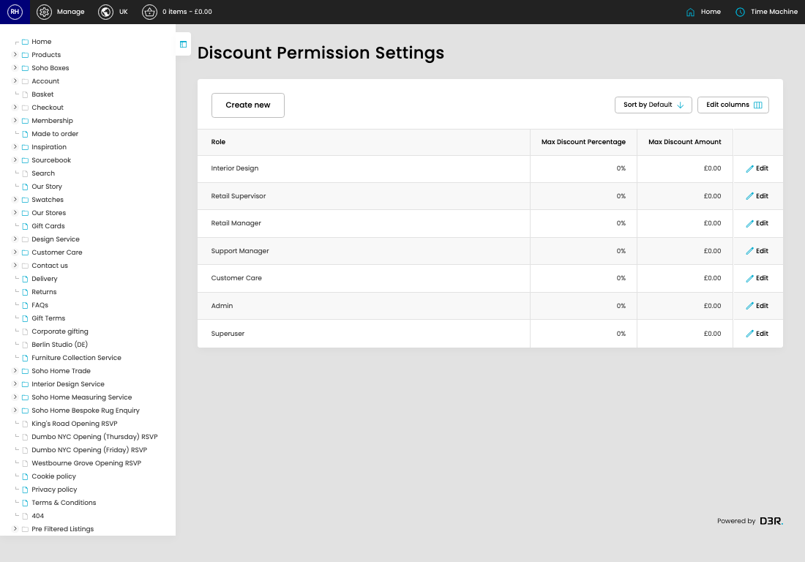

# Discount Permission Settings

[Home](../../index.md) / Discount Permission Settings

URL: [https://sohohome.com/cp/discount-permission-settings-admin](https://sohohome.com/cp/discount-permission-settings-admin)

The listing shows the role-based limits that control custom discounts.

*Discount Permission Settings page overview*

## Related Pages

- [Edit Discount Permission Setting](../060-cp-discount-permission-settings-admin-edit-id-4014e007/README.md): Update the percentage or fixed amount limit for an existing role.

## How It Works

- The key fields are Role, Max Discount Percentage, and Max Discount Amount, which explain what the record is for and how it can be used.

## Using This Page

1. Review the role, maximum percentage, and maximum fixed amount columns.

## What You Can Do

### Review role limits

Start here to see which admin roles already have custom discount limits set.

- Visible fields include Role, Max Discount Percentage, and Max Discount Amount.

Example rows:

| Role | Max Discount Percentage | Max Discount Amount |
| --- | --- | --- |
| Interior Design | 0% | £0.00 |
| Retail Supervisor | 0% | £0.00 |
| Retail Manager | 0% | £0.00 |
