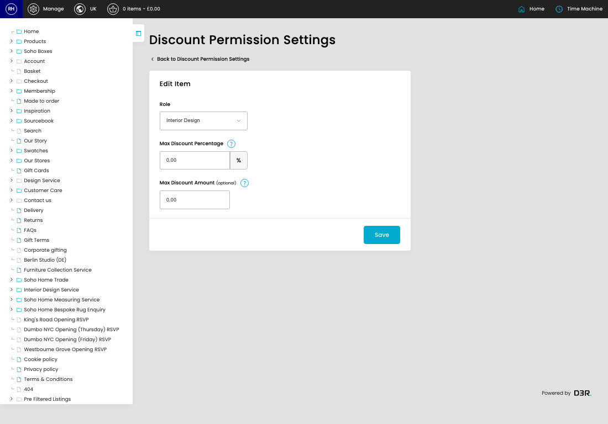
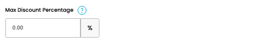
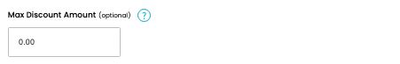

# Discount Permission Settings

[Home](../../index.md) / [Discount Permission Settings](../059-cp-discount-permission-settings-admin-71eed775/README.md) / Edit Discount Permission Setting

URL: [https://sohohome.com/cp/discount-permission-settings-admin/edit/:id](https://sohohome.com/cp/discount-permission-settings-admin/edit/:id)

This form is for checking or updating the discount limits assigned to an admin role.

*Discount Permission Settings page overview*

## Related Pages

- [Discount Permission Settings](../059-cp-discount-permission-settings-admin-71eed775/README.md): Review the roles that already have custom discount limits.

## How It Works

- The key fields are Role, Max Discount Percentage, and Max Discount Amount, which explain what the record is for and how it can be used.

## Using This Page

1. Review the selected role and current discount limits.
2. Update the maximum percentage discount or fixed amount cap where needed.
3. Select Save to apply the updated limit.

## What You Can Do

### Edit a role limit

Open an existing role limit to change the percentage cap or fixed amount cap.

- Save when the updated limits look right.

### Set the discount limit

Choose the role, enter the maximum percentage discount, and add a fixed amount cap if needed.

- Use 100 for an unlimited percentage allowance.
- Use 0 in Max Discount Amount for no fixed-amount cap.

## Key Settings

### Edit Item

#### Role

*Role setting*

Choose the admin role this discount limit applies to.

**Effect:** Sets which admin role the discount limit applies to.

**Options:** Superuser, Admin, Product Master, Customer Care, Marketing, Content, Interior Design, Retail - Amsterdam, Retail - Austin, Retail - Bicester, Retail - Berlin, Retail - Carnaby, and 17 more

#### Max Discount Percentage

*Max Discount Percentage setting*

Enter the highest percentage discount this role can apply.

**Effect:** Sets the highest percentage discount this role can apply.

**Notes:** Enter a value from 0 to 100. Use 100 when the role should be able to apply any percentage discount.

#### Max Discount Amount (optional)

*Max Discount Amount (optional) setting*

Enter the highest fixed discount amount this role can apply, or use 0 for no fixed-amount cap.

**Effect:** Sets the highest fixed discount amount this role can apply.

**Notes:** Set this to 0 when the role should not have a fixed-amount cap.
