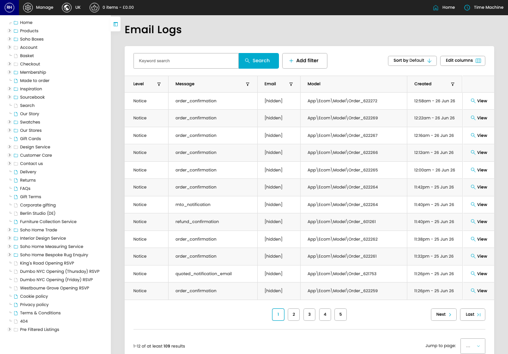

# Email Logs

[Home](../../index.md) / Email Logs

URL: [https://sohohome.com/cp/email-log-admin](https://sohohome.com/cp/email-log-admin)

Simple email event logger.

*Email Logs page overview*

## Related Pages

- [View Email Log](../062-cp-email-log-admin-view-id-ed23cf72/README.md): Open an existing email log when you need to check the full details.

## How It Works

- Makes sure the transfer property is set appropriately.
- The key fields are Log, Email, Model, and Context, which explain what the record is for and how it can be used.

## Using This Page

1. Search or filter until you find the email log you need.

## What You Can Do

### Review email logs

Search or filter the visible fields to find the email log you need.

- Visible fields include Level, Message, Email, Model, and Created.

Example rows:

| Level | Message | Email | Model | Created |
| --- | --- | --- | --- | --- |
| Notice | order_confirmation | [hidden] | App\Ecom\Model\Order_622272 | 12:58am - 26 Jun 26 |
| Notice | order_confirmation | [hidden] | App\Ecom\Model\Order_622269 | 12:22am - 26 Jun 26 |
| Notice | order_confirmation | [hidden] | App\Ecom\Model\Order_622267 | 12:16am - 26 Jun 26 |
