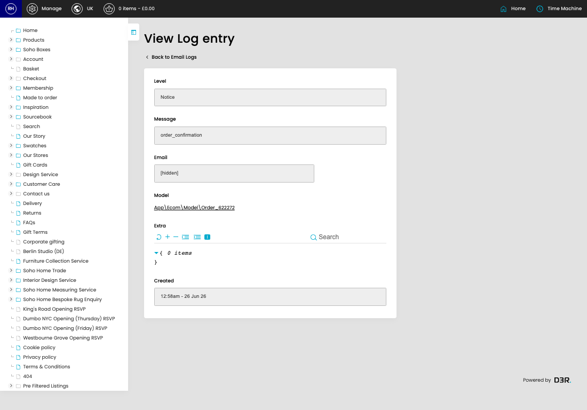

# Email Logs

[Home](../../index.md) / [Email Logs](../061-cp-email-log-admin-2dd4dfdd/README.md) / View Email Log

URL: [https://sohohome.com/cp/email-log-admin/view/:id](https://sohohome.com/cp/email-log-admin/view/:id)

Simple email event logger.

*Email Logs page overview*

## Related Pages

- [Email Logs](../061-cp-email-log-admin-2dd4dfdd/README.md): Search or filter the visible fields to find the email log you need.

## How It Works

- Makes sure the transfer property is set appropriately.
- The key fields are Log, Email, Model, and Context, which explain what the record is for and how it can be used.

## Using This Page

1. Open the existing email log you need to review.
2. Use the visible fields to check the details.

## What You Can Do

### Review an existing email log

Open an existing email log when you need to check the full details.
