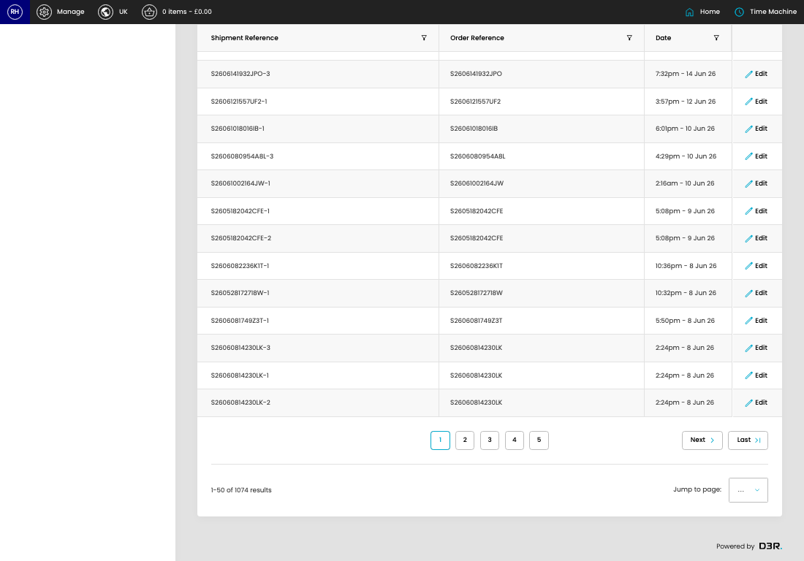

# Empty Shipments

[Home](../../index.md) / Empty Shipments

URL: [https://sohohome.com/cp/empty_shipments-admin](https://sohohome.com/cp/empty_shipments-admin)

Admin listing for empty shipments

*Empty Shipments page overview*

## How It Works

- Makes sure the transfer property is set appropriately.

## Using This Page

1. Open Empty Shipments from the CP navigation.
2. Search or filter until you find the empty shipment you need.

## What You Can Do

### Review empty shipments

Search or filter the visible fields to find the empty shipment you need.

- Field: Shipment Reference
- Field: Order Reference
- Field: Date

Example rows:

| Shipment Reference | Order Reference | Date |
| --- | --- | --- |
| S26062522361UA-1 | S26062522361UA | 10:42pm - 25 Jun 26 |
| S26062522361UA-2 | S26062522361UA | 10:42pm - 25 Jun 26 |
| S2606241527HEG-1 | S2606241527HEG | 8:45pm - 25 Jun 26 |
