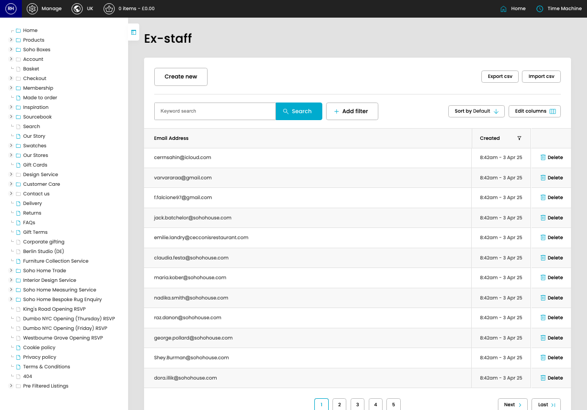

# Ex-Staff

[Home](../../index.md) / Ex-Staff

URL: [https://sohohome.com/cp/ex-staff-admin](https://sohohome.com/cp/ex-staff-admin)

Blacklist for staff group emails

*Ex-Staff page overview*

## Related Pages

- [Create Ex-Staff](../065-cp-ex-staff-admin-edit-new-7778b486/README.md): Use Create new when this ex-staff does not already exist. Complete the fields that describe it, then save.

## How It Works

- Makes sure the transfer property is set appropriately.
- The key fields are Email Address, which explain what the record is for and how it can be used.

## Using This Page

1. Open Ex-Staff from the CP navigation.
2. Search or filter until you find the ex-staff you need.

## What You Can Do

### Review ex-staff

Search or filter the visible fields to find the ex-staff you need.

- Field: Email Address
- Field: Created

Example rows:

| Email Address | Created |
| --- | --- |
| cerrnsahin@icloud.com | 8:42am - 3 Apr 25 |
| varvararaa@gmail.com | 8:42am - 3 Apr 25 |
| f.falcione97@gmail.com | 8:42am - 3 Apr 25 |

## Available Actions

- Import csv
