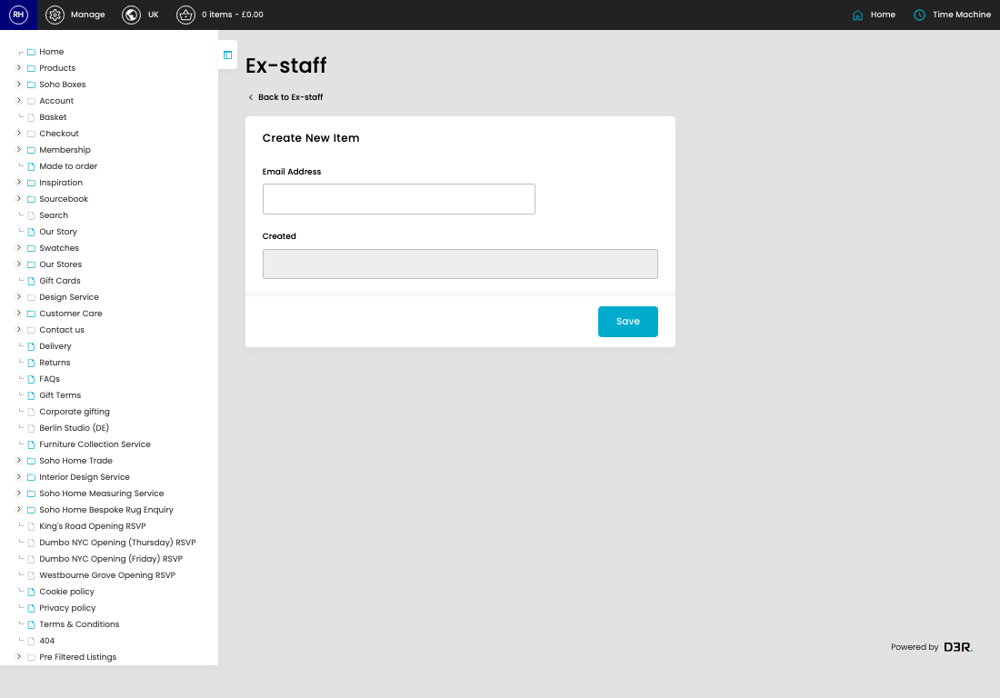
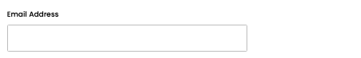

# Ex-Staff

[Home](../../index.md) / Create Ex-Staff

URL: [https://sohohome.com/cp/ex-staff-admin/edit/new](https://sohohome.com/cp/ex-staff-admin/edit/new)

Blacklist for staff group emails

*Ex-Staff page overview*

## Related Pages

- [Ex-Staff](../064-cp-ex-staff-admin-0b7db221/README.md): Search or filter the visible fields to find the ex-staff you need.

## How It Works

- Makes sure the transfer property is set appropriately.
- The key fields are Email Address, which explain what the record is for and how it can be used.

## Using This Page

1. Create the new ex-staff from this screen.
2. Work through the fields that are relevant to the new record.
3. Save once the details are correct.

## What You Can Do

### Create a new ex-staff

Use Create new when this ex-staff does not already exist. Complete the fields that describe it, then save.

### Update settings

Use the fields on this screen to make the change, then save once the values are correct.

## Key Settings

### Create New Item

#### Email Address

*Email Address setting*

Add the email address.

**Validation:** Required.
