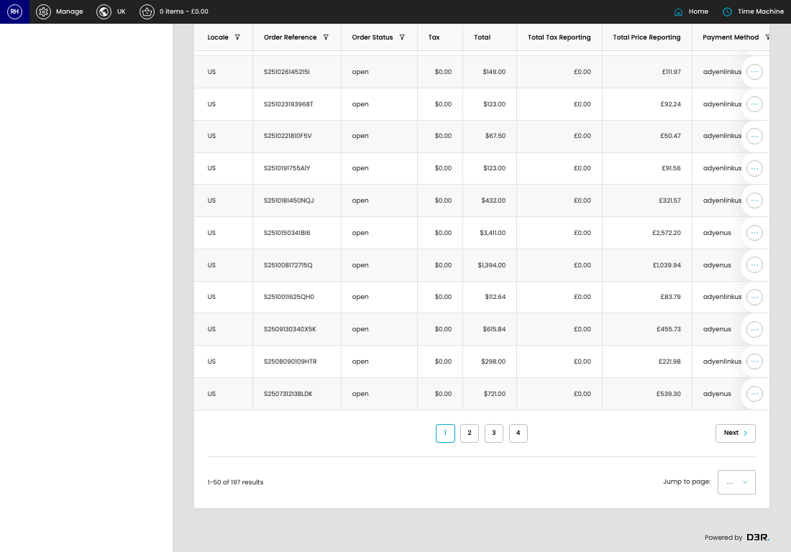
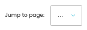

# Failed Orders (Avalara)

[Home](../../index.md) / Failed Orders (Avalara)

URL: [https://sohohome.com/cp/failed-avarala-orders-admin](https://sohohome.com/cp/failed-avarala-orders-admin)

Admin listing for orders that have failed to send to Avalara.

*Failed Orders (Avalara) page overview*

## Using This Page

1. Open Failed Orders (Avalara) from the CP navigation.
2. Scan the fields in the table to find the failed orders (avalara) you need.

## What You Can Do

### Review failed orders (avalara)

Review the visible fields to check what already exists.

- Field: Locale
- Field: Order Reference
- Field: Order Status
- Field: Tax
- Field: Total
- Field: Total Tax Reporting
- Field: Total Price Reporting
- Field: Payment Method
- Field: Error
- Field: Error Detail
- Field: Error Created
- Field: Automated Status

Example rows:

| Locale | Order Reference | Order Status | Tax | Total | Total Tax Reporting |
| --- | --- | --- | --- | --- | --- |
| US | S2606042146LEE | open | $0.00 | $63.95 | £0.00 |
| US | S2605042108MO7 | open | $0.00 | $1,451.00 | £0.00 |
| US | S2605020417SDG | open | $0.00 | $560.00 | £0.00 |

## Key Settings

The sections below highlight the settings people are most likely to change.

### Failed Orders (Avalara)

#### select

*select setting*

Choose the option that matches this select.

**Options:** Load saved view, Zip invalid

## Available Actions

- Unresolved
- All
- Grouped
- Manage saved views
