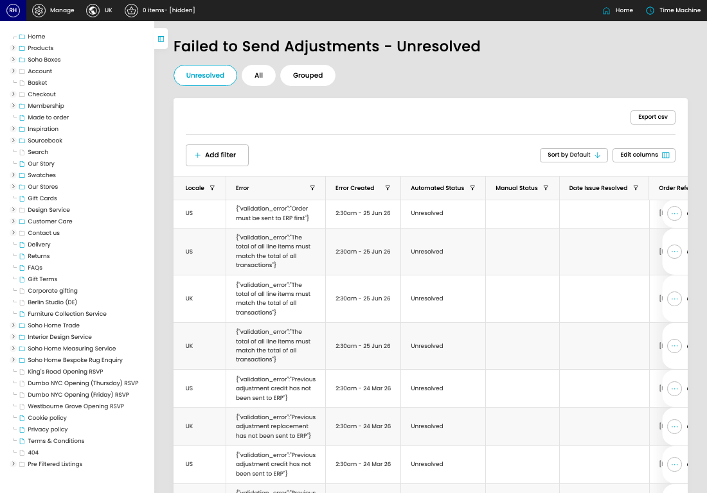

# Failed Adjustments

[Home](../../index.md) / Failed Adjustments

URL: [https://sohohome.com/cp/failed-bc-adjustments-admin](https://sohohome.com/cp/failed-bc-adjustments-admin)

Failed Adjustments summarise order adjustments and related finance-system transfer activity for review.

*Failed Adjustments page overview*

## How It Works

- The key fields are Adjustment Suffix, Adjustment Value, Adjustment Reporting Value, Adjustment Created, and Adjustment Flags, which explain what the record is for and how it can be used.

## Using This Page

1. Open Failed Adjustments from the CP navigation.
2. Scan the fields in the table to find the failed adjustment you need.

## What You Can Do

### Review failed adjustments

Review the visible fields to check what already exists.

- Field: Locale
- Field: Error
- Field: Error Created
- Field: Automated Status
- Field: Manual Status
- Field: Date Issue Resolved
- Field: Order Reference
- Field: Order Status
- Field: Adjustment Suffix
- Field: Adjustment Value
- Field: Adjustment Reporting Value
- Field: Adjustment Created

Example rows:

| Locale | Error | Error Created | Automated Status | Manual Status | Date Issue Resolved |
| --- | --- | --- | --- | --- | --- |
| US | {"validation_error":"Order must be sent to ERP first"} | 2:30am - 25 Jun 26 | Unresolved |  |  |
| US | {"validation_error":"The total of all line items must match the total of all transactions" | 2:30am - 25 Jun 26 | Unresolved |  |  |
| UK | {"validation_error":"The total of all line items must match the total of all transactions" | 2:30am - 25 Jun 26 | Unresolved |  |  |

## Available Actions

- Unresolved
- All
- Grouped
