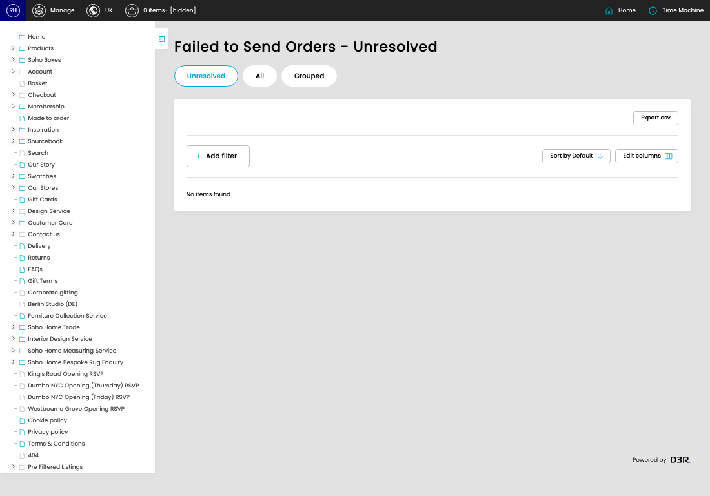

# Failed Orders

[Home](../../index.md) / Failed Orders

URL: [https://sohohome.com/cp/failed-bc-orders-admin](https://sohohome.com/cp/failed-bc-orders-admin)

Admin listing for orders that have failed to send to Business Central.

*Failed Orders page overview*

## How It Works

- The key fields are Tax, Total, Total Tax Reporting, Total Price Reporting, and Payment Method, which explain what the record is for and how it can be used.

## Using This Page

1. Open the Failed Orders screen.
2. Use the visible fields to check the details.

## Page Sections

- Unresolved
- All
- Grouped
