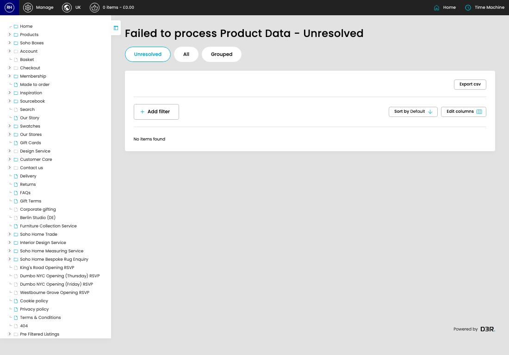

# Failed Product Data

[Home](../../index.md) / Failed Product Data

URL: [https://sohohome.com/cp/failed-bc-product-data-admin](https://sohohome.com/cp/failed-bc-product-data-admin)

Admin listing for product data that has failed to be applied from Business Central.

*Failed Product Data page overview*

## How It Works

- The key fields are Error, Error Created, Automated Status, Manual Status, and Date Issue Resolved, which explain what the record is for and how it can be used.

## Using This Page

1. Open the Failed Product Data screen.
2. Use the visible fields to check the details.

## Available Actions

- Unresolved
- All
- Grouped
