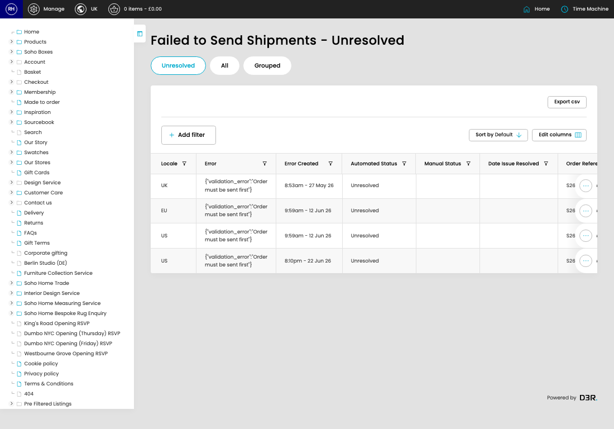

# Failed Shipments

[Home](../../index.md) / Failed Shipments

URL: [https://sohohome.com/cp/failed-bc-shipments-admin](https://sohohome.com/cp/failed-bc-shipments-admin)

Admin listing for shipmnets that have failed to send to Business Central

*Failed Shipments page overview*

## How It Works

- The key fields are Shipment Reference, Shipment Status, Shipment Created, Shipment Value, and Shipment Reporting Value, which explain what the record is for and how it can be used.

## Using This Page

1. Open Failed Shipments from the CP navigation.
2. Scan the fields in the table to find the failed shipment you need.

## What You Can Do

### Review failed shipments

Review the visible fields to check what already exists.

- Field: Locale
- Field: Error
- Field: Error Created
- Field: Automated Status
- Field: Manual Status
- Field: Date Issue Resolved
- Field: Order Reference
- Field: Order Status
- Field: Shipment Reference
- Field: Shipment Status
- Field: Shipment Created
- Field: Shipment Value

Example rows:

| Locale | Error | Error Created | Automated Status | Manual Status | Date Issue Resolved |
| --- | --- | --- | --- | --- | --- |
| UK | {"validation_error":"Order must be sent first"} | 8:53am - 27 May 26 | Unresolved |  |  |
| EU | {"validation_error":"Order must be sent first"} | 9:59am - 12 Jun 26 | Unresolved |  |  |
| US | {"validation_error":"Order must be sent first"} | 9:59am - 12 Jun 26 | Unresolved |  |  |

## Available Actions

- Unresolved
- All
- Grouped
