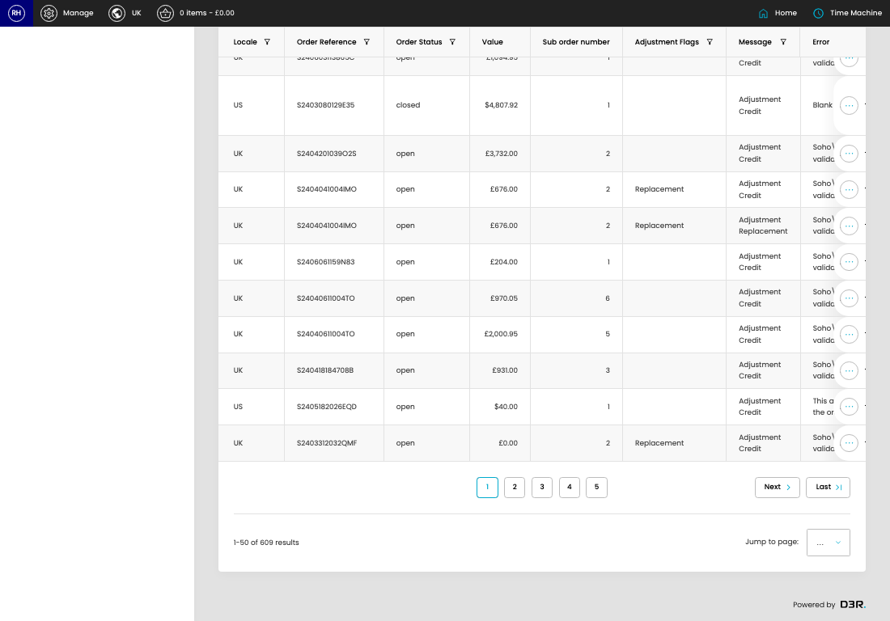

# Failed Adjustments (Sage)

[Home](../../index.md) / Failed Adjustments (Sage)

URL: [https://sohohome.com/cp/failed-sage-adjustments-admin](https://sohohome.com/cp/failed-sage-adjustments-admin)

Failed Adjustments (Sage) summarise order adjustments and related finance-system transfer activity for review.

*Failed Adjustments (Sage) page overview*

## How It Works

- The key fields are Locale, Order Reference, Order Status, Value, and Sub order number, which explain what the record is for and how it can be used.

## Using This Page

1. Open Failed Adjustments (Sage) from the CP navigation.
2. Scan the fields in the table to find the failed adjustments (sage) you need.

## What You Can Do

### Review failed adjustments (sage)

Review the visible fields to check what already exists.

- Field: Locale
- Field: Order Reference
- Field: Order Status
- Field: Value
- Field: Sub order number
- Field: Adjustment Flags
- Field: Message
- Field: Error
- Field: Error Detail
- Field: Order Created
- Field: Adjustment Created
- Field: Error Created

Example rows:

| Locale | Order Reference | Order Status | Value | Sub order number | Adjustment Flags |
| --- | --- | --- | --- | --- | --- |
| US | S3042400131145 | open | $500.00 | 1 |  |
| US | S3122019414002 | closed | $1,916.00 | 3 |  |
| US | S24052502405JN | open | $400.00 | 1 |  |

## Available Actions

- Unresolved
- All
- Grouped
- Mismatched
