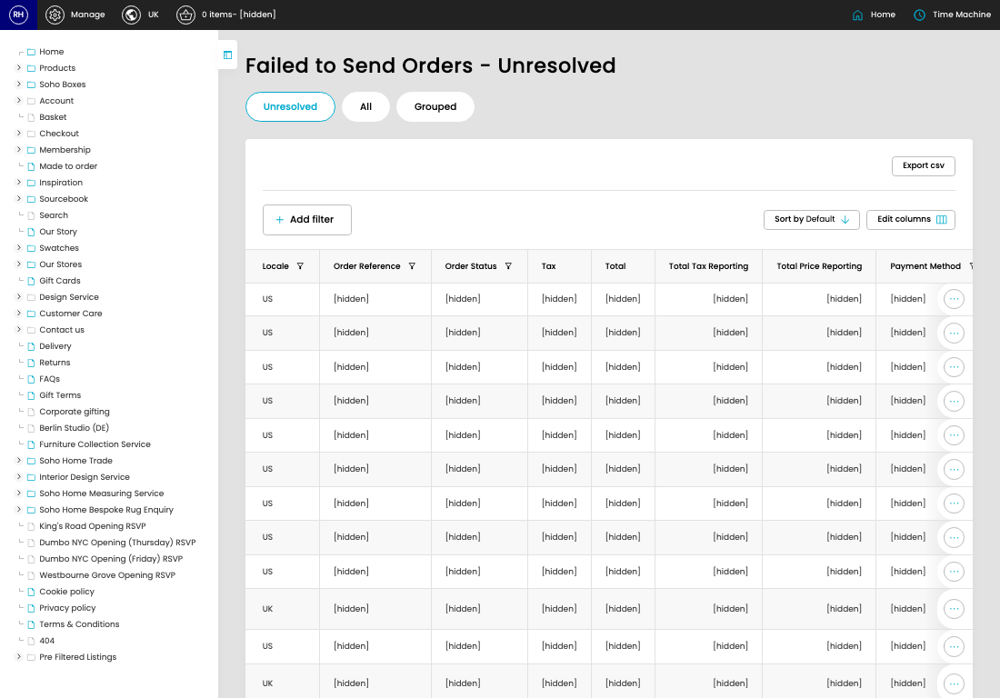

# Failed Orders (Sage)

[Home](../../index.md) / Failed Orders (Sage)

URL: [https://sohohome.com/cp/failed-sage-orders-admin](https://sohohome.com/cp/failed-sage-orders-admin)

Admin listing for orders that have failed to send to Sage.

*Failed Orders (Sage) page overview*

## How It Works

- The key fields are Locale, Order Reference, Order Status, Tax, and Total, which explain what the record is for and how it can be used.

## Using This Page

1. Open Failed Orders (Sage) from the CP navigation.
2. Scan the fields in the table to find the failed orders (sage) you need.

## What You Can Do

### Review failed orders (sage)

Review the visible fields to check what already exists.

- Field: Locale
- Field: Order Reference
- Field: Order Status
- Field: Tax
- Field: Total
- Field: Total Tax Reporting
- Field: Total Price Reporting
- Field: Payment Method
- Field: Error
- Field: Error Detail
- Field: Error Created
- Field: Automated Status

Example rows:

| Locale | Order Reference | Order Status | Tax | Total | Total Tax Reporting |
| --- | --- | --- | --- | --- | --- |
| US | S24072523496TZ | open | $487.15 | $6,516.81 | £380.08 |
| US | S2407240406T47 | open | $679.77 | $8,438.97 | £519.52 |
| US | S2407222047OHZ | open | $42.92 | $2,517.25 | £33.94 |

## Available Actions

- Unresolved
- All
- Grouped
