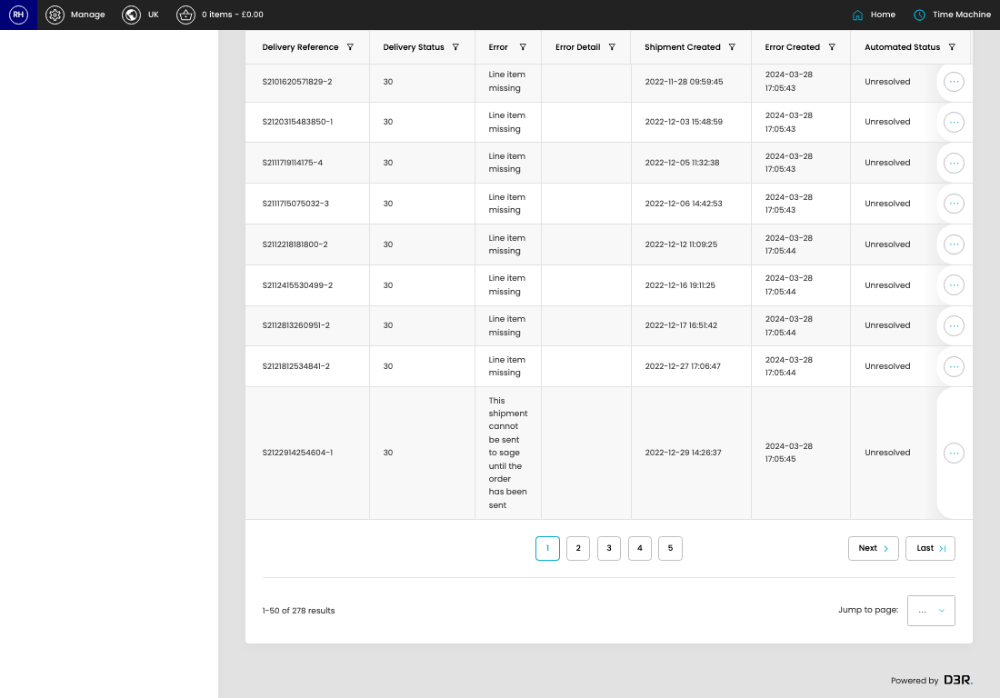

# Failed Shipments (Sage)

[Home](../../index.md) / Failed Shipments (Sage)

URL: [https://sohohome.com/cp/failed-sage-shipments-admin](https://sohohome.com/cp/failed-sage-shipments-admin)

Admin listing for shipmnets that have failed to send to Sage

*Failed Shipments (Sage) page overview*

## How It Works

- The key fields are Delivery Reference, Delivery Status, Error, Error Detail, and Shipment Created, which explain what the record is for and how it can be used.

## Using This Page

1. Open Failed Shipments (Sage) from the CP navigation.
2. Scan the fields in the table to find the failed shipments (sage) you need.

## What You Can Do

### Review failed shipments (sage)

Review the visible fields to check what already exists.

- Field: Delivery Reference
- Field: Delivery Status
- Field: Error
- Field: Error Detail
- Field: Shipment Created
- Field: Error Created
- Field: Automated Status
- Field: Manual Status
- Field: Date Issue Resolved

Example rows:

| Delivery Reference | Delivery Status | Error | Error Detail | Shipment Created | Error Created |
| --- | --- | --- | --- | --- | --- |
| WEB20081218273081-1 | 30 | This shipment cannot be sent to sage until the order has been sent |  | 2020-08-12 18:27:31 | 2024-03-28 17:05:35 |
| WEB20081218423025-1 | 30 | This shipment cannot be sent to sage until the order has been sent |  | 2020-08-12 18:42:32 | 2024-03-28 17:05:35 |
| WEB20081301411286-1 | 30 | This shipment cannot be sent to sage until the order has been sent |  | 2020-08-13 01:41:19 | 2024-03-28 17:05:35 |

## Available Actions

- Unresolved
- All
- Grouped
