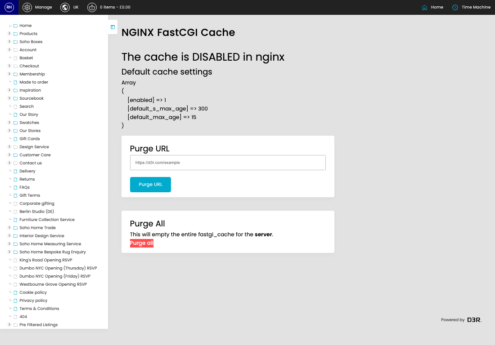
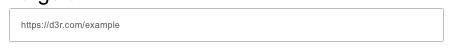

# FastCGI Cache

[Home](../../index.md) / FastCGI Cache

URL: [https://sohohome.com/cp/fastcgi-cache](https://sohohome.com/cp/fastcgi-cache)

FastCGI Cache shows the details for this fastcgi cache.

*FastCGI Cache page overview*

## Using This Page

1. Open the FastCGI Cache screen.
2. Use the visible fields to check the details.

## Key Settings

### Purge URL

#### https://d3r.com/example

*https://d3r.com/example setting*

Use the expected format shown by the placeholder: "https://d3r.com/example".

## Page Sections

- Purge URL
- Purge all
