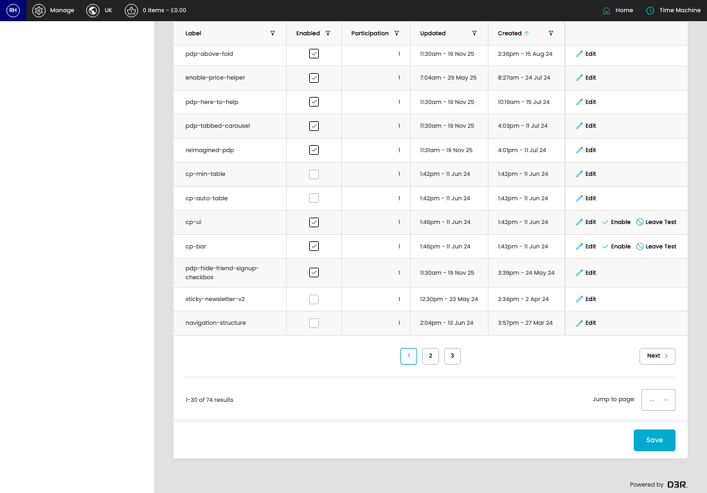
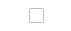

# Feature Flips

[Home](../../index.md) / Feature Flips

URL: [https://sohohome.com/cp/flipflop-admin](https://sohohome.com/cp/flipflop-admin)

This is the actual switch, or case, but they are reserved keywords, so trial it is.

*Feature Flips page overview*

## Related Pages

- [Edit Feature Flip](../076-cp-flipflop-admin-edit-76-0d5ea9f5/README.md): Open an existing feature flip when you need to check the setup or make a change.

## Using This Page

1. Open Feature Flips from the CP navigation.
2. Search or filter until you find the feature flip you need.

## What You Can Do

### Review feature flips

Search or filter the visible fields to find the feature flip you need.

- Field: Label
- Field: Enabled
- Field: Participation
- Field: Updated
- Field: Created

Example rows:

| Label | Enabled | Participation | Updated | Created |
| --- | --- | --- | --- | --- |
| navigation-structure-v3 |  | 1 | 2:55pm - 13 May 26 | 4:31pm - 1 Apr 26 |
| basket-membership-v2 |  | 1 | 2:59pm - 31 Mar 26 | 2:39pm - 31 Mar 26 |
| plp-limit |  | 0.4 | 4:39pm - 23 Mar 26 | 2:08pm - 23 Mar 26 |

### Update settings

Use the fields on this screen to make the change, then save once the values are correct.

## Key Settings

The sections below highlight the settings people are most likely to change.

### listing-flipflop_trial-form

#### Trial Enabled

*Trial Enabled setting*

Set the Trial Enabled value for each relevant row in this section.
