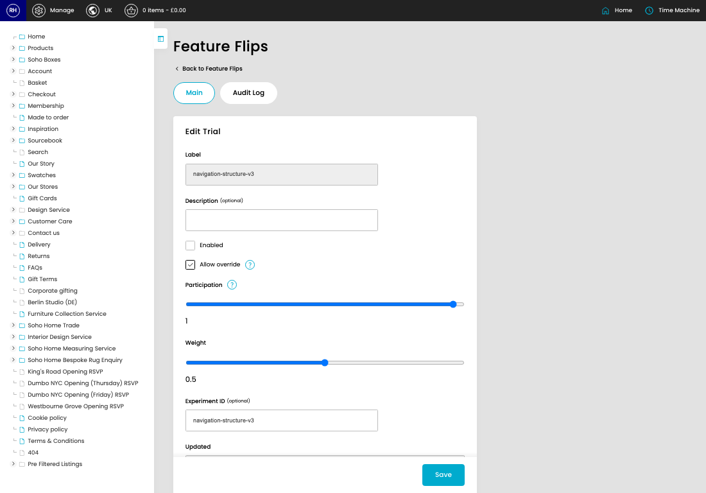
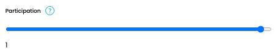
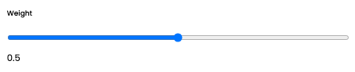
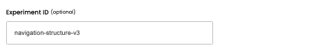

# Feature Flips

[Home](../../index.md) / [Feature Flips](../075-cp-flipflop-admin-9b16c8a5/README.md) / Edit Feature Flip

URL: [https://sohohome.com/cp/flipflop-admin/edit/:id](https://sohohome.com/cp/flipflop-admin/edit/:id)

This is the actual switch, or case, but they are reserved keywords, so trial it is.

*Feature Flips page overview*

## Related Pages

- [Feature Flips](../075-cp-flipflop-admin-9b16c8a5/README.md): Search or filter the visible fields to find the feature flip you need.

## Using This Page

1. Open the existing feature flip you need to change.
2. Work through the fields that are relevant to the change.
3. Save once the details are correct.

## What You Can Do

### Edit an existing feature flip

Open an existing feature flip when you need to check the setup or make a change.

- Save once the details are correct.

## Key Settings

### Edit Trial

#### Description (optional)

*Description (optional) setting*

Add the description (optional).

**Notes:** optional

#### Enabled

Turn this on when enabled should apply. Leave it off when it should not.

#### Allow override

Turn this on when allow override should apply. Leave it off when it should not.

#### Participation

*Participation setting*

Add the participation.

#### Weight

*Weight setting*

Add the weight.

**Notes:** optional

#### Experiment ID (optional)

*Experiment ID (optional) setting*

Add the experiment ID (optional).

**Notes:** optional

## Page Sections

- Main
- Audit Log
