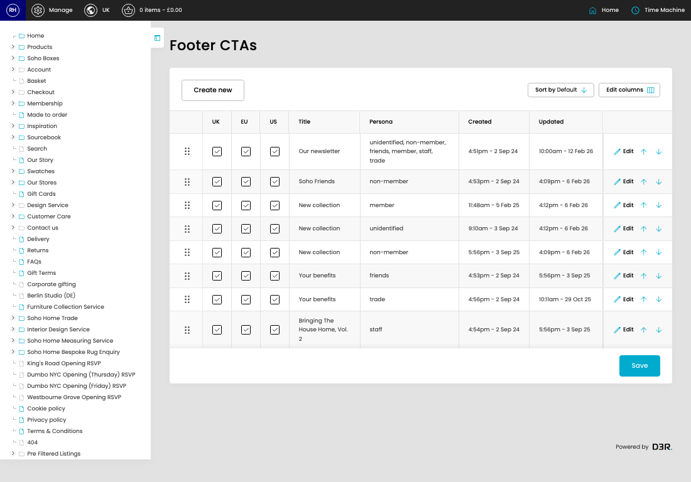

# Footer CTAs

[Home](../../index.md) / Footer CTAs

URL: [https://sohohome.com/cp/footer-ctas-admin](https://sohohome.com/cp/footer-ctas-admin)

Footer CTAs lets admins find and review existing footer ctas.

*Footer CTAs page overview*

## Related Pages

- [Edit Footer CTA](../078-cp-footer-ctas-admin-edit-id-08610242/README.md): Open an existing footer CTA when you need to check the setup or make a change.

## How It Works

- The key fields are Title, Persona, Copy, Image, and CTA, which explain what the record is for and how it can be used.

## Using This Page

1. Scan the fields in the table to find the footer CTA you need.

## What You Can Do

### Review footer ctas

Review the visible fields to check what already exists.

- Visible fields include UK, EU, US, Title, Persona, Created, and Updated.

Example rows:

| UK | EU | US | Title | Persona | Created |
| --- | --- | --- | --- | --- | --- |
|  |  |  |  | Our newsletter | unidentified, non-member, friends, member, staff, trade |
|  |  |  |  | Soho Friends | non-member |
|  |  |  |  | New collection | member |

### Update settings

Use the fields on this screen to make the change, then save once the values are correct.
