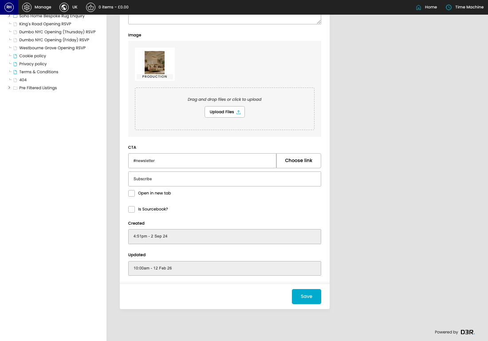
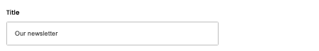

# Footer CTAs

[Home](../../index.md) / [Footer CTAs](../077-cp-footer-ctas-admin-139ebcf0/README.md) / Edit Footer CTA

URL: [https://sohohome.com/cp/footer-ctas-admin/edit/:id](https://sohohome.com/cp/footer-ctas-admin/edit/:id)

Use this screen when you need to check or change an existing footer CTA.

*Footer CTAs page overview*

## Related Pages

- [Footer CTAs](../077-cp-footer-ctas-admin-139ebcf0/README.md): Review the visible fields to check what already exists.

## How It Works

- The key fields are Title, Persona, Copy, Image, and CTA, which explain what the record is for and how it can be used.

## Using This Page

1. Open the existing footer CTA you need to change.
2. Work through the fields that are relevant to the change.
3. Save once the details are correct.

## What You Can Do

### Edit an existing footer CTA

Open an existing footer CTA when you need to check the setup or make a change.

- Save once the details are correct.

## Key Settings

### Edit Footer CTA

#### UK

Turn this on when UK should apply. Leave it off when it should not.

#### EU

Turn this on when EU should apply. Leave it off when it should not.

#### US

Turn this on when US should apply. Leave it off when it should not.

#### Title

*Title setting*

Add the title.

**Validation:** Required.

#### unidentified

Turn this on when unidentified should apply. Leave it off when it should not.

#### non-member

Turn this on when non-member should apply. Leave it off when it should not.

#### friends

Turn this on when friends should apply. Leave it off when it should not.

#### member

Turn this on when member should apply. Leave it off when it should not.

#### staff

Turn this on when staff should apply. Leave it off when it should not.

#### trade

Turn this on when trade should apply. Leave it off when it should not.

#### Copy

Write the copy content.

**Validation:** Required.

#### Link

Use the expected format shown by the placeholder: "Link".

#### Label

Use the expected format shown by the placeholder: "Label".

#### Open in new tab

Turn this on when open in new tab should apply. Leave it off when it should not.

#### Is Sourcebook?

Turn this on when the answer should be yes. Leave it off when it should not apply.

## Page Sections

- Upload Files
- Choose link
