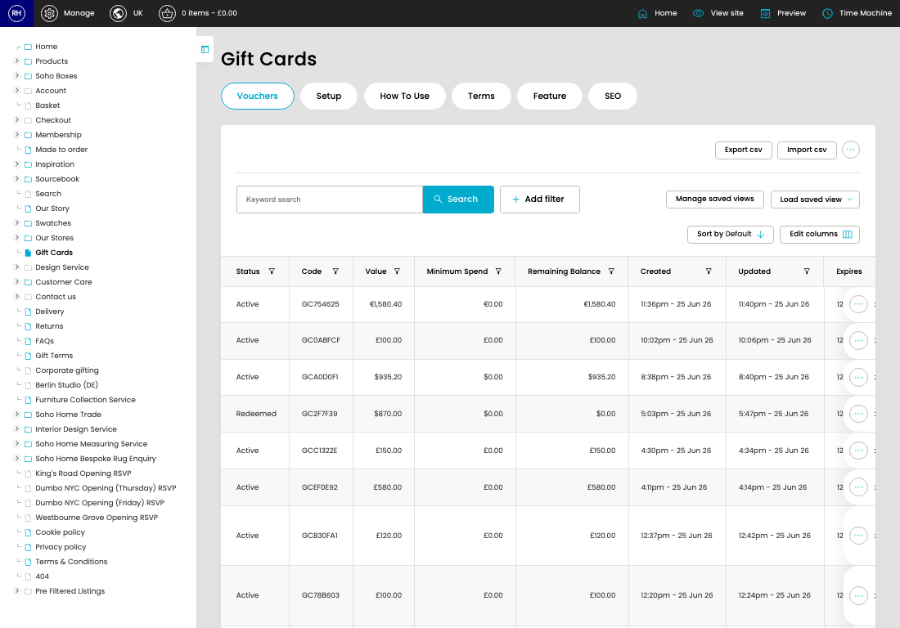

# Gift Cards

[Home](../../index.md) / Gift Cards

URL: [https://sohohome.com/cp/gift-cards](https://sohohome.com/cp/gift-cards)

Gift Cards lets admins find and review existing gift cards.

*Gift Cards page overview*

## Related Pages

- [Edit Gift Card](../080-cp-gift-cards-edit-98785-6e9644b1/README.md): Open an existing gift card when you need to check the setup or make a change.

## Using This Page

1. Open Gift Cards from the CP navigation.
2. Search or filter until you find the gift card you need.

## What You Can Do

### Review gift cards

Search or filter the visible fields to find the gift card you need.

- Field: Status
- Field: Code
- Field: Value
- Field: Minimum Spend
- Field: Remaining Balance
- Field: Created
- Field: Updated
- Field: Expires
- Field: Purchased By
- Field: From
- Field: Receipient's Name
- Field: Instance

Example rows:

| Status | Code | Value | Minimum Spend | Remaining Balance | Created |
| --- | --- | --- | --- | --- | --- |
| Active | GC754625 | €1,580.40 | €0.00 | €1,580.40 | 11:36pm - 25 Jun 26 |
| Active | GC0ABFCF | £100.00 | £0.00 | £100.00 | 10:02pm - 25 Jun 26 |
| Active | GCA0D0F1 | $935.20 | $0.00 | $935.20 | 8:38pm - 25 Jun 26 |

## Key Settings

The sections below highlight the settings people are most likely to change.

### Gift Cards

#### select

*select setting*

Choose the option that matches this select.

**Options:** Load saved view, GC liability MMW

## Available Actions

- Vouchers
- Setup
- How To Use
- Terms
- Feature
- SEO
- Import csv
- Manage saved views
