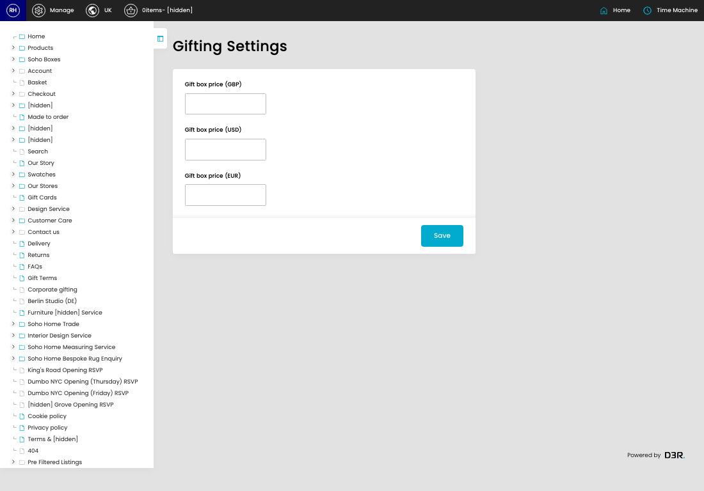
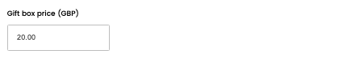
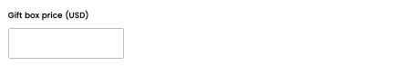
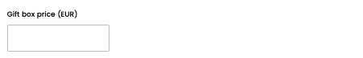

# Gifting Settings

[Home](../../index.md) / Gifting Settings

URL: [https://sohohome.com/cp/gifting-settings-admin](https://sohohome.com/cp/gifting-settings-admin)

Gifting Settings covers the admin screen used to review and maintain gifting settings.

*Gifting Settings page overview*

## How It Works

- Makes sure the transfer property is set appropriately.
- The key fields are Gift box price (GBP), Gift box price (USD), and Gift box price (EUR), which explain what the record is for and how it can be used.

## Using This Page

1. Open the Gifting Settings screen.
2. Work through the fields that are relevant to the change, then save once the details are correct.

## What You Can Do

### Update settings

Use the fields on this screen to make the change, then save once the values are correct.

## Key Settings

### Gifting Settings

#### Gift box price (GBP)

*Gift box price (GBP) setting*

Add the gift box price (GBP).

**Validation:** Required.

#### Gift box price (USD)

*Gift box price (USD) setting*

Add the gift box price (USD).

**Validation:** Required.

#### Gift box price (EUR)

*Gift box price (EUR) setting*

Add the gift box price (EUR).

**Validation:** Required.
