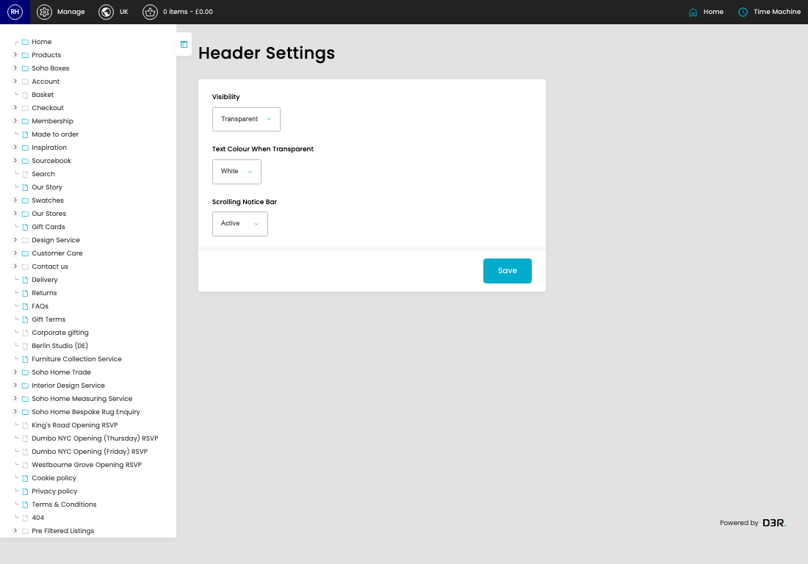
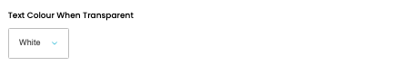

# Header Settings

[Home](../../index.md) / Header Settings

URL: [https://sohohome.com/cp/header-settings](https://sohohome.com/cp/header-settings)

Header Settings

*Header Settings page overview*

## How It Works

- The key fields are Visibility, Text Colour When Transparent, and Scrolling Notice Bar, which explain what the record is for and how it can be used.

## Using This Page

1. Open the Header Settings screen.
2. Work through the fields that are relevant to the change, then save once the details are correct.

## What You Can Do

### Update settings

Use the fields on this screen to make the change, then save once the values are correct.

## Key Settings

### Header Settings

#### Visibility

*Visibility setting*

Choose the option that matches this visibility.

**Options:** Standard, Transparent

#### Text Colour When Transparent

*Text Colour When Transparent setting*

Choose the option that matches this text colour when transparent.

**Options:** Black, White

#### Scrolling Notice Bar

*Scrolling Notice Bar setting*

Choose the option that matches this scrolling notice bar.

**Options:** Active, Inactive
