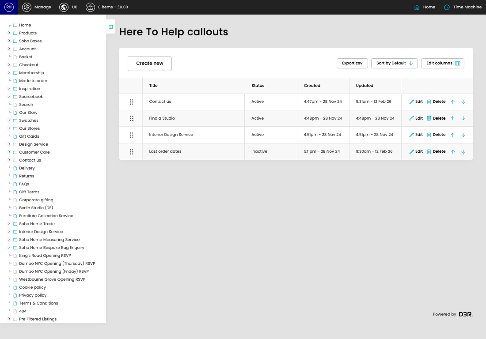

# Here To Help Callouts

[Home](../../index.md) / Here To Help Callouts

URL: [https://sohohome.com/cp/here-to-help-callouts-admin](https://sohohome.com/cp/here-to-help-callouts-admin)

Manage the Here to Help callouts

*Here To Help Callouts page overview*

## Related Pages

- [Edit Here To Help Callout](../084-cp-here-to-help-callouts-admin-edit-id-5a4a8dd2/README.md): Open an existing here to help callout when you need to check the setup or make a change.

## How It Works

- The key fields are Title, Image, Status, Link, and Position, which explain what the record is for and how it can be used.

## Using This Page

1. Scan the fields in the table to find the here to help callout you need.

## What You Can Do

### Review here to help callouts

Review the visible fields to check what already exists.

- Visible fields include Title, Status, Created, and Updated.

Example rows:

| Title | Status | Created | Updated |
| --- | --- | --- | --- |
|  | Contact us | Active | 4:47pm - 28 Nov 24 |
|  | Find a Studio | Active | 4:48pm - 28 Nov 24 |
|  | Interior Design Service | Active | 4:51pm - 28 Nov 24 |
