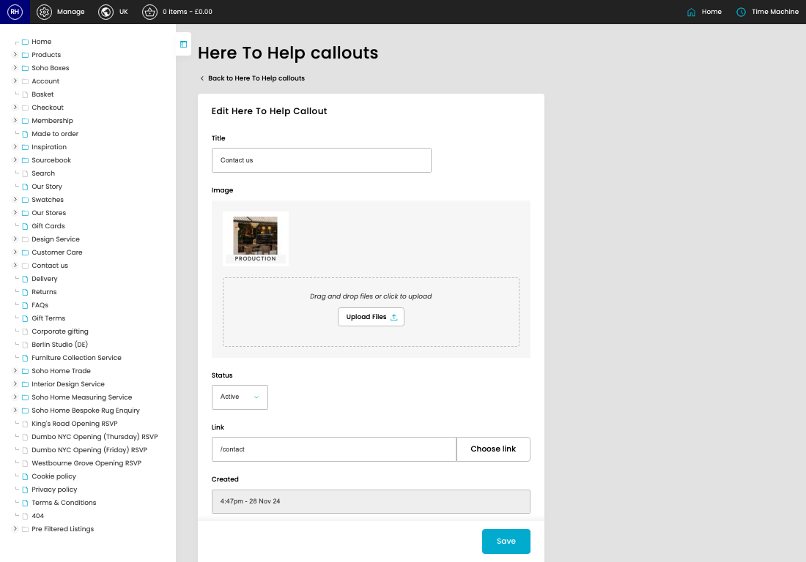
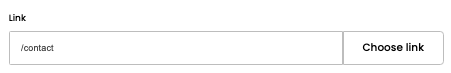

# Here To Help Callouts

[Home](../../index.md) / [Here To Help Callouts](../083-cp-here-to-help-callouts-admin-84efef9a/README.md) / Edit Here To Help Callout

URL: [https://sohohome.com/cp/here-to-help-callouts-admin/edit/:id](https://sohohome.com/cp/here-to-help-callouts-admin/edit/:id)

Manage the Here to Help callouts

*Here To Help Callouts page overview*

## Related Pages

- [Here To Help Callouts](../083-cp-here-to-help-callouts-admin-84efef9a/README.md): Review the visible fields to check what already exists.

## How It Works

- The key fields are Title, Image, Status, Link, and Position, which explain what the record is for and how it can be used.

## Using This Page

1. Open the existing here to help callout you need to change.
2. Work through the fields that are relevant to the change.
3. Save once the details are correct.

## What You Can Do

### Edit an existing here to help callout

Open an existing here to help callout when you need to check the setup or make a change.

- Save once the details are correct.

## Key Settings

### Edit Here To Help Callout

#### Title

*Title setting*

Add the title.

**Validation:** Required.

#### Status

*Status setting*

Choose the option that matches this status.

**Options:** Active, Inactive

#### Link

*Link setting*

Add the link.

## Page Sections

- Upload Files
- Choose link
