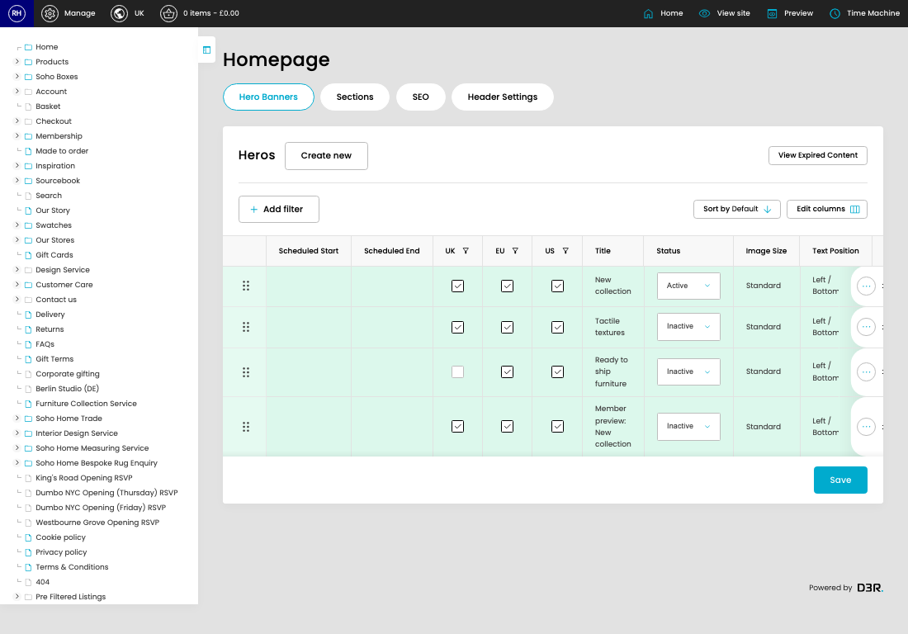

# Homepage v2

[Home](../../index.md) / Homepage V2

URL: [https://sohohome.com/cp/homepage-v2](https://sohohome.com/cp/homepage-v2)

Site home page model this is custom for each site

*Homepage v2 page overview*

## How It Works

- The key fields are Instance and Heros, which explain what the record is for and how it can be used.

## Using This Page

1. Scan the fields in the table to find the homepage v2 you need.

## What You Can Do

### Review homepage v2

Review the visible fields to check what already exists.

- Visible fields include Scheduled Start, Scheduled End, UK, EU, US, Title, Status, and Image Size.

### Update settings

Use the fields on this screen to make the change, then save once the values are correct.

## Page Sections

- Hero Banners
- Sections
- SEO
- Header Settings
- View Expired Content
