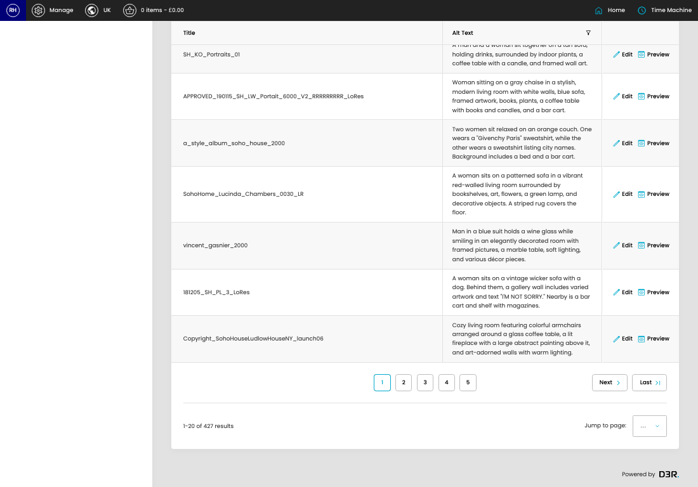

# Image Assets (Export/Import)

[Home](../../index.md) / Image Assets (Export/Import)

URL: [https://sohohome.com/cp/image-asset-admin](https://sohohome.com/cp/image-asset-admin)

Image Assets (Export/Import) manages reusable image assets used across content and merchandising areas.

*Image Assets (Export/Import) page overview*

## Related Pages

- [Image Assets (Export/Import) Pages](../215-cp-image-asset-admin-pages-c25fa6b0/README.md): Search or filter the visible fields to find the image assets (export/import) you need.

## Using This Page

1. Search or filter until you find the image assets (export/import) you need.

## What You Can Do

### Review image assets (export/import)

Search or filter the visible fields to find the image assets (export/import) you need.

- Visible fields include Title and Alt Text.

Example rows:

| Title | Alt Text |
| --- | --- |
| Vicky_blog | A woman sits smiling in a mustard-colored chair in a bright room with framed art, a wicker |
| Gold_liquer_glasses_212 | Champagne being poured into glass coupes, surrounded by lit candles and greenery on a wood |
| Copyright_Soho_House_Babington_House_Coach_House_Bedroom_1705_SM_LR_02 |  |

## Page Sections

- Pages
- Blocks
- Products
- Stores
- Miscellaneous
