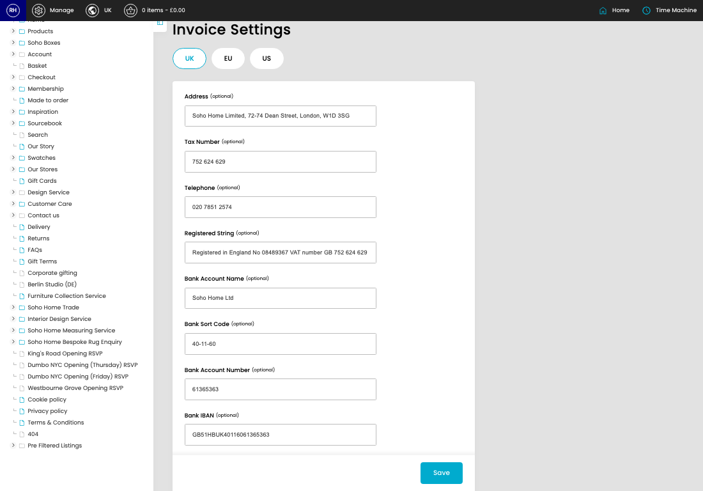
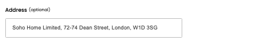
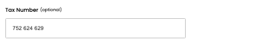
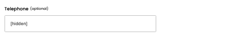
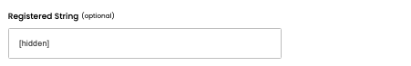
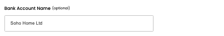
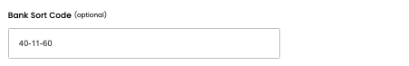
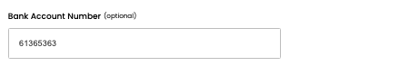
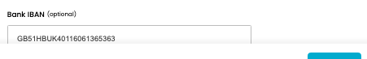

# Invoice Settings

[Home](../../index.md) / Invoice Settings

URL: [https://sohohome.com/cp/invoice-settings-admin](https://sohohome.com/cp/invoice-settings-admin)

Invoice Settings covers the admin screen used to review and maintain invoice settings.

*Invoice Settings page overview*

## How It Works

- Makes sure the transfer property is set appropriately.
- The key fields are Address, Tax Number, Telephone, Registered String, and Bank Account Name, which explain what the record is for and how it can be used.

## Using This Page

1. Open the Invoice Settings screen.
2. Work through the fields that are relevant to the change, then save once the details are correct.

## What You Can Do

### Update settings

Use the fields on this screen to make the change, then save once the values are correct.

## Key Settings

### Invoice Settings

#### Address (optional)

*Address (optional) setting*

Add the address (optional).

**Notes:** optional

#### Tax Number (optional)

*Tax Number (optional) setting*

Add the tax number (optional).

**Notes:** optional

#### Telephone (optional)

*Telephone (optional) setting*

Add the telephone (optional).

**Notes:** optional

#### Registered String (optional)

*Registered String (optional) setting*

Add the registered string (optional).

**Notes:** optional

#### Bank Account Name (optional)

*Bank Account Name (optional) setting*

Add the bank account name (optional).

**Notes:** optional

#### Bank Sort Code (optional)

*Bank Sort Code (optional) setting*

Add the bank sort code (optional).

**Notes:** optional

#### Bank Account Number (optional)

*Bank Account Number (optional) setting*

Add the bank account number (optional).

**Notes:** optional

#### Bank IBAN (optional)

*Bank IBAN (optional) setting*

Add the bank IBAN (optional).

**Notes:** optional

#### Bank SWIFT Code (optional)

Add the bank SWIFT code (optional).

**Notes:** optional

## Available Actions

- UK
- EU
- US
